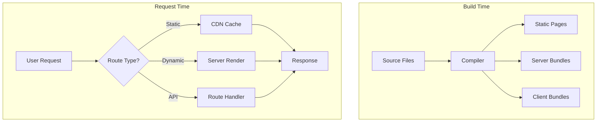

# Next.js Foundations & Core Concepts

> "Simplicity is the ultimate sophistication." — Leonardo da Vinci

Next.js is the React framework for production. It provides hybrid static & server rendering, TypeScript support, smart bundling, route pre-fetching, and more—out of the box. Understanding Next.js deeply is essential for any senior full-stack engineer building modern web applications.

---

## Professional Definition

Next.js is a full-stack React meta-framework that abstracts the complexity of production-ready React applications:

| Layer | What It Provides | Why Senior Engineers Care |
|-------|------------------|---------------------------|
| Rendering Strategies | SSG, SSR, ISR, CSR in a single app | Choose the right strategy per page based on data freshness needs and performance requirements |
| File-System Routing | Routes derived from filesystem structure | Zero-config routing that scales from 10 to 10,000 pages without manual route definitions |
| Server Components | React Server Components (RSC) as default | Smaller client bundles, direct database access, reduced client-server waterfalls |
| Data Fetching | Integrated fetch with caching & revalidation | Automatic request deduplication, fine-grained cache control, streaming |
| Edge Runtime | Run at the edge (CDN) or Node.js | Sub-50ms response times globally for dynamic content |
| API Routes | Full-stack API development | Build entire backends without separate API server infrastructure |

---

## Simple Explanation (Feynman Backpack Edition)

Imagine you're running a restaurant:

1. **Create React App** = You have a kitchen (React), but customers must wait while you cook everything from scratch. No pre-made dishes, no takeout menu.

2. **Next.js** = You're now a fully-equipped restaurant chain:
   - **Pre-made dishes (SSG)**: Popular items are prepared ahead and served instantly
   - **Made-to-order (SSR)**: Complex orders cooked fresh when requested
   - **Reheated specials (ISR)**: Yesterday's popular dish, refreshed every hour
   - **Takeout menu (API Routes)**: Kitchen also handles phone orders
   - **Multiple locations (Edge)**: Franchise kitchens worldwide for faster delivery

The framework handles the supply chain, kitchen scheduling, and delivery logistics—you just focus on your recipes (components).

---

## Next.js 14/15 Architecture (App Router)



---

## App Router vs Pages Router

Next.js has two routing systems. The **App Router** (introduced in v13) is the future:

| Feature | Pages Router (`/pages`) | App Router (`/app`) |
|---------|-------------------------|---------------------|
| Released | Next.js 1.0 (2016) | Next.js 13.4 (2023) |
| Components | Client Components only | Server Components default |
| Data Fetching | `getServerSideProps`, `getStaticProps` | `async` components, `fetch()` |
| Layouts | Manual via `_app.js` | Nested layouts built-in |
| Loading States | Manual | `loading.js` convention |
| Error Handling | `_error.js` global | `error.js` per route |
| Streaming | Limited | Full streaming support |
| Status | Stable, maintenance mode | Stable, recommended |

**Senior Recommendation:** All new projects should use App Router. Migrate existing Pages Router apps incrementally—both can coexist.

---

## Project Structure (App Router)

```
my-next-app/
├── app/
│   ├── layout.tsx          # Root layout (required)
│   ├── page.tsx            # Home page (/)
│   ├── loading.tsx         # Loading UI for /
│   ├── error.tsx           # Error boundary for /
│   ├── not-found.tsx       # 404 for /
│   ├── global-error.tsx    # Global error boundary
│   │
│   ├── dashboard/
│   │   ├── layout.tsx      # Dashboard layout
│   │   ├── page.tsx        # /dashboard
│   │   ├── loading.tsx     # Dashboard loading
│   │   └── settings/
│   │       └── page.tsx    # /dashboard/settings
│   │
│   ├── blog/
│   │   ├── page.tsx        # /blog
│   │   └── [slug]/
│   │       └── page.tsx    # /blog/:slug
│   │
│   └── api/
│       └── users/
│           └── route.ts    # API: /api/users
│
├── components/             # Shared components
├── lib/                    # Utility functions
├── public/                 # Static assets
├── next.config.js          # Next.js configuration
├── tailwind.config.js      # Tailwind (if used)
└── tsconfig.json           # TypeScript config
```

---

## Special Files Convention

| File | Purpose |
|------|---------|
| `page.tsx` | UI unique to a route (makes route publicly accessible) |
| `layout.tsx` | Shared UI wrapping children (persists across navigation) |
| `loading.tsx` | Loading UI using React Suspense |
| `error.tsx` | Error UI using React Error Boundary |
| `not-found.tsx` | 404 UI for the segment |
| `route.ts` | API endpoint (Route Handler) |
| `template.tsx` | Like layout but remounts on navigation |
| `default.tsx` | Fallback for parallel routes |

---

## Creating Your First Route

```tsx
// app/page.tsx - Home page
export default function HomePage() {
  return (
    <main>
      <h1>Welcome to Next.js</h1>
      <p>This is a Server Component by default</p>
    </main>
  );
}
```

```tsx
// app/about/page.tsx - About page at /about
export default function AboutPage() {
  return (
    <main>
      <h1>About Us</h1>
    </main>
  );
}
```

---

## Root Layout (Required)

Every Next.js app requires a root layout that defines the HTML structure:

```tsx
// app/layout.tsx
import type { Metadata } from 'next';
import { Inter } from 'next/font/google';
import './globals.css';

const inter = Inter({ subsets: ['latin'] });

export const metadata: Metadata = {
  title: 'My Next.js App',
  description: 'Built with Next.js 14',
};

export default function RootLayout({
  children,
}: {
  children: React.ReactNode;
}) {
  return (
    <html lang="en">
      <body className={inter.className}>
        <header>
          <nav>{/* Navigation */}</nav>
        </header>
        <main>{children}</main>
        <footer>{/* Footer */}</footer>
      </body>
    </html>
  );
}
```

---

## Dynamic Routes

### Single Parameter

```tsx
// app/users/[id]/page.tsx
// Matches: /users/1, /users/abc, /users/john-doe

interface PageProps {
  params: Promise<{ id: string }>;
}

export default async function UserPage({ params }: PageProps) {
  const { id } = await params;
  const user = await fetchUser(id);
  
  return <h1>User: {user.name}</h1>;
}
```

### Multiple Parameters

```tsx
// app/blog/[category]/[slug]/page.tsx
// Matches: /blog/tech/my-post, /blog/news/breaking-story

interface PageProps {
  params: Promise<{
    category: string;
    slug: string;
  }>;
}

export default async function BlogPost({ params }: PageProps) {
  const { category, slug } = await params;
  return <h1>{category}: {slug}</h1>;
}
```

### Catch-All Routes

```tsx
// app/docs/[...slug]/page.tsx
// Matches: /docs/a, /docs/a/b, /docs/a/b/c

interface PageProps {
  params: Promise<{ slug: string[] }>;
}

export default async function DocsPage({ params }: PageProps) {
  const { slug } = await params;
  // slug = ['a', 'b', 'c'] for /docs/a/b/c
  return <h1>Docs: {slug.join('/')}</h1>;
}
```

### Optional Catch-All

```tsx
// app/docs/[[...slug]]/page.tsx
// Matches: /docs, /docs/a, /docs/a/b

// The double brackets make the parameter optional
// /docs → slug = undefined
// /docs/a → slug = ['a']
```

---

## Linking and Navigation

### Link Component

```tsx
import Link from 'next/link';

export default function Navigation() {
  return (
    <nav>
      {/* Basic link */}
      <Link href="/">Home</Link>
      
      {/* Dynamic route */}
      <Link href="/users/123">User Profile</Link>
      
      {/* With query params */}
      <Link href="/search?q=nextjs">Search</Link>
      
      {/* Object syntax */}
      <Link 
        href={{
          pathname: '/blog/[slug]',
          query: { slug: 'my-post' },
        }}
      >
        Blog Post
      </Link>
      
      {/* Replace instead of push */}
      <Link href="/login" replace>Login</Link>
      
      {/* Disable prefetch */}
      <Link href="/heavy-page" prefetch={false}>Heavy Page</Link>
      
      {/* Scroll to top disabled */}
      <Link href="/same-page#section" scroll={false}>Section</Link>
    </nav>
  );
}
```

### Programmatic Navigation

```tsx
'use client';

import { useRouter, usePathname, useSearchParams } from 'next/navigation';

export default function NavigationDemo() {
  const router = useRouter();
  const pathname = usePathname();
  const searchParams = useSearchParams();

  function handleNavigation() {
    // Push new route
    router.push('/dashboard');
    
    // Replace current route
    router.replace('/login');
    
    // Go back
    router.back();
    
    // Go forward
    router.forward();
    
    // Refresh current route (re-fetch server components)
    router.refresh();
    
    // Prefetch a route
    router.prefetch('/heavy-page');
  }

  return (
    <div>
      <p>Current path: {pathname}</p>
      <p>Query: {searchParams.get('q')}</p>
      <button onClick={() => router.push('/dashboard')}>
        Go to Dashboard
      </button>
    </div>
  );
}
```

---

## Configuration (next.config.js)

```javascript
/** @type {import('next').NextConfig} */
const nextConfig = {
  // Strict mode for development
  reactStrictMode: true,
  
  // Image optimization domains
  images: {
    remotePatterns: [
      {
        protocol: 'https',
        hostname: 'images.example.com',
      },
    ],
  },
  
  // Environment variables (public)
  env: {
    NEXT_PUBLIC_API_URL: process.env.NEXT_PUBLIC_API_URL,
  },
  
  // Redirects
  async redirects() {
    return [
      {
        source: '/old-blog/:slug',
        destination: '/blog/:slug',
        permanent: true, // 308 status
      },
    ];
  },
  
  // Rewrites (proxy)
  async rewrites() {
    return [
      {
        source: '/api/proxy/:path*',
        destination: 'https://external-api.com/:path*',
      },
    ];
  },
  
  // Headers
  async headers() {
    return [
      {
        source: '/api/:path*',
        headers: [
          { key: 'Access-Control-Allow-Origin', value: '*' },
        ],
      },
    ];
  },
  
  // Experimental features
  experimental: {
    // Enable PPR (Partial Prerendering) - Next.js 14+
    ppr: true,
  },
};

module.exports = nextConfig;
```

---

## Environment Variables

```bash
# .env.local (gitignored - local secrets)
DATABASE_URL="postgresql://..."
API_SECRET="super-secret-key"

# .env (committed - defaults)
NEXT_PUBLIC_APP_NAME="My App"

# .env.production (production overrides)
NEXT_PUBLIC_API_URL="https://api.production.com"
```

**Access patterns:**

```tsx
// Server-side (any variable)
const dbUrl = process.env.DATABASE_URL;

// Client-side (only NEXT_PUBLIC_ prefix)
const appName = process.env.NEXT_PUBLIC_APP_NAME;
```

---

## Senior-Level Interview Prompts & Answers

### 1. "What's the difference between App Router and Pages Router?"

**Answer:** The App Router (Next.js 13+) uses React Server Components by default, enabling:
- Automatic code splitting at the component level
- Direct database/API access in components without API routes
- Nested layouts that persist across navigation
- Streaming and Suspense for progressive loading
- Parallel and intercepted routes for complex UIs

Pages Router uses Client Components, requiring `getServerSideProps`/`getStaticProps` for server data, with less granular control over layouts and loading states.

### 2. "When would you use Edge Runtime vs Node.js Runtime?"

**Answer:** 
- **Edge Runtime**: For globally distributed, low-latency responses (auth checks, A/B testing, geo-personalization). Limited to Web APIs, no Node.js modules.
- **Node.js Runtime**: For complex computations, database connections, file system access, or when you need full Node.js APIs.

Choose Edge for speed-critical paths, Node.js for feature-rich backend logic.

### 3. "How does Next.js handle caching?"

**Answer:** Next.js has four caching layers:
1. **Request Memoization**: Same `fetch` in render tree deduped
2. **Data Cache**: Persistent cache for fetch results across requests
3. **Full Route Cache**: Static routes cached as HTML/RSC payload
4. **Router Cache**: Client-side cache of visited routes

Understanding when to opt out (`cache: 'no-store'`, `revalidate: 0`) is crucial for dynamic content.

### 4. "How do you handle authentication in Next.js?"

**Answer:** Multiple strategies:
- **Middleware**: Check auth before route access (fastest, runs at edge)
- **Layout**: Wrap protected routes in auth-checking layout
- **Server Components**: Check auth directly in components
- **Route Handlers**: Protect API endpoints

Use libraries like NextAuth.js/Auth.js for OAuth, or implement custom JWT/session handling with httpOnly cookies.

---

## Common Pitfalls & Best Practices

| Pitfall | Solution |
|---------|----------|
| Using `'use client'` everywhere | Only add when you need hooks, event handlers, or browser APIs |
| Ignoring caching behavior | Explicitly set `cache` and `revalidate` options |
| Large client bundles | Keep components server-side; pass serializable props to client components |
| Not handling loading states | Add `loading.tsx` files for better UX |
| Forgetting error boundaries | Add `error.tsx` to gracefully handle failures |
| Exposing secrets | Never use non-NEXT_PUBLIC_ env vars in client components |

---

## Next Steps

1. **Server & Client Components** - Deep dive into RSC architecture
2. **Data Fetching** - Server actions, caching, revalidation
3. **Rendering Strategies** - SSG, SSR, ISR, streaming
4. **Route Handlers** - Building APIs
5. **Authentication** - Securing your application
