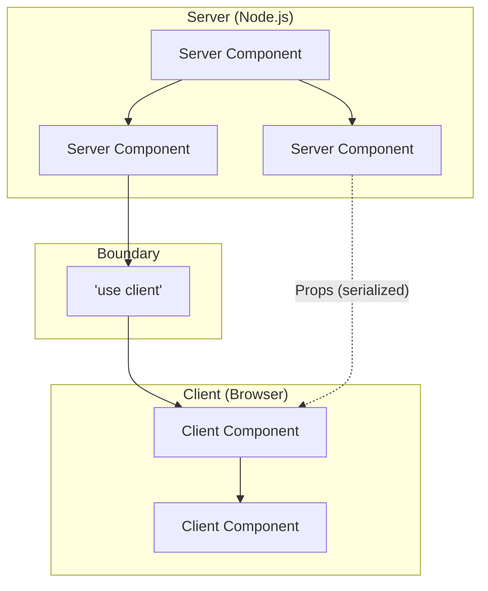
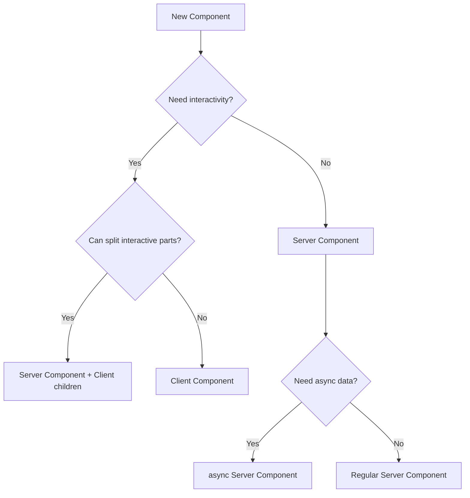

# Server & Client Components

> "The art of simplicity is a puzzle of complexity." — Douglas Horton

React Server Components (RSC) are the foundation of Next.js App Router. Understanding when components run on the server vs. client—and how to compose them—is the key skill that separates senior Next.js engineers from beginners.

---

## Professional Definition

| Concept | Definition | Why Seniors Care |
|---------|------------|------------------|
| Server Components | Components rendered on the server, with zero JavaScript sent to the client | Smaller bundles, direct backend access, better SEO, faster initial loads |
| Client Components | Components that include interactivity, requiring JavaScript in the browser | Necessary for user events, browser APIs, React hooks like useState |
| Component Boundary | The `'use client'` directive that marks where server→client transition happens | Strategic placement determines bundle size and user experience |
| Serialization | Data passed from server to client must be serializable (JSON-safe) | Functions, classes, Dates require special handling |

---

## Simple Explanation (Feynman Backpack Edition)

Think of a movie production:

1. **Server Components** = Pre-recorded scenes. The expensive CGI, stunts, and effects are done in the studio (server). Audience receives the final footage—no equipment shipped to theaters.

2. **Client Components** = Live performers in the theater. When you need audience interaction (voting, choose-your-adventure), you need real actors (JavaScript) on-site.

3. **The Boundary (`'use client'`)** = The screen edge. Everything behind it is pre-recorded (server). Actors can reference the recording but can't change it.

**The goal:** Maximize pre-recorded content, minimize live performers needed.

---

## The Mental Model



---

## Server Components (Default)

In the App Router, components are Server Components by default:

```tsx
// app/users/page.tsx - Server Component (default)
import { db } from '@/lib/database';

export default async function UsersPage() {
  // ✅ Direct database access - no API needed!
  const users = await db.user.findMany();
  
  // ✅ Can use server-only code
  const apiKey = process.env.SECRET_API_KEY;
  
  // ✅ Can use async/await at component level
  const data = await fetch('https://api.example.com/data');
  
  return (
    <ul>
      {users.map(user => (
        <li key={user.id}>{user.name}</li>
      ))}
    </ul>
  );
}
```

### What Server Components CAN Do

| Capability | Example |
|------------|---------|
| Access backend resources directly | Database queries, file system |
| Use server-only secrets | `process.env.API_SECRET` |
| Async/await in component body | `const data = await fetch(...)` |
| Import server-only packages | `import { db } from 'prisma'` |
| Reduce client bundle size | Heavy libraries stay on server |
| Stream content progressively | Combine with Suspense |

### What Server Components CANNOT Do

| Limitation | Why |
|------------|-----|
| Use React hooks (`useState`, `useEffect`) | Hooks require client runtime |
| Access browser APIs | No `window`, `document`, `localStorage` |
| Add event handlers | `onClick`, `onChange` need client JS |
| Use Context with state | Context providers with dynamic values need client |

---

## Client Components

Add `'use client'` directive at the top of the file:

```tsx
'use client';

// app/components/Counter.tsx - Client Component
import { useState } from 'react';

export default function Counter() {
  const [count, setCount] = useState(0);
  
  return (
    <div>
      <p>Count: {count}</p>
      <button onClick={() => setCount(c => c + 1)}>
        Increment
      </button>
    </div>
  );
}
```

### When to Use Client Components

| Use Case | Example |
|----------|---------|
| Interactive UI | Buttons, forms, modals, dropdowns |
| State management | `useState`, `useReducer`, Zustand |
| Lifecycle effects | `useEffect`, subscriptions |
| Browser APIs | localStorage, geolocation, clipboard |
| Event listeners | onClick, onSubmit, onKeyDown |
| Custom hooks with state | `useForm`, `useQuery` |
| Third-party libraries | Many npm packages assume client |

---

## Composition Patterns

### Pattern 1: Server Parent, Client Child

```tsx
// app/dashboard/page.tsx (Server Component)
import { db } from '@/lib/database';
import InteractiveChart from '@/components/InteractiveChart';

export default async function DashboardPage() {
  // Fetch data on server
  const analyticsData = await db.analytics.getMonthlyData();
  
  return (
    <div>
      <h1>Dashboard</h1>
      {/* Pass serializable data to client component */}
      <InteractiveChart data={analyticsData} />
    </div>
  );
}
```

```tsx
'use client';

// components/InteractiveChart.tsx (Client Component)
import { useState } from 'react';
import { Chart } from 'chart.js';

interface Props {
  data: { month: string; value: number }[]; // Must be serializable
}

export default function InteractiveChart({ data }: Props) {
  const [selectedMonth, setSelectedMonth] = useState<string | null>(null);
  
  return (
    <div onClick={(e) => handleClick(e)}>
      {/* Interactive chart */}
    </div>
  );
}
```

### Pattern 2: Client Wrapper, Server Children (Slot Pattern)

```tsx
'use client';

// components/Modal.tsx (Client Component)
import { useState, ReactNode } from 'react';

interface Props {
  trigger: ReactNode;
  children: ReactNode; // Can be Server Components!
}

export default function Modal({ trigger, children }: Props) {
  const [isOpen, setIsOpen] = useState(false);
  
  return (
    <>
      <div onClick={() => setIsOpen(true)}>{trigger}</div>
      {isOpen && (
        <div className="modal">
          {children} {/* Server Component rendered here */}
          <button onClick={() => setIsOpen(false)}>Close</button>
        </div>
      )}
    </>
  );
}
```

```tsx
// app/products/page.tsx (Server Component)
import Modal from '@/components/Modal';
import ProductDetails from '@/components/ProductDetails'; // Server Component

export default async function ProductsPage() {
  return (
    <Modal trigger={<button>View Details</button>}>
      {/* This Server Component is passed as children */}
      <ProductDetails productId="123" />
    </Modal>
  );
}
```

### Pattern 3: Extracting Client Logic

```tsx
// ❌ Bad: Entire component becomes client
'use client';

export default function ProductPage({ productId }: { productId: string }) {
  const [quantity, setQuantity] = useState(1);
  const product = await fetchProduct(productId); // Won't work!
  
  return (
    <div>
      <h1>{product.name}</h1>
      <input value={quantity} onChange={e => setQuantity(e.target.value)} />
    </div>
  );
}
```

```tsx
// ✅ Good: Split server and client parts

// app/products/[id]/page.tsx (Server Component)
import { fetchProduct } from '@/lib/products';
import QuantitySelector from '@/components/QuantitySelector';

export default async function ProductPage({ 
  params 
}: { 
  params: Promise<{ id: string }> 
}) {
  const { id } = await params;
  const product = await fetchProduct(id);
  
  return (
    <div>
      <h1>{product.name}</h1>
      <p>{product.description}</p>
      <QuantitySelector productId={id} price={product.price} />
    </div>
  );
}

// components/QuantitySelector.tsx (Client Component)
'use client';

import { useState } from 'react';

export function QuantitySelector({ productId, price }: { 
  productId: string;
  price: number;
}) {
  const [quantity, setQuantity] = useState(1);
  
  return (
    <div>
      <input 
        type="number" 
        value={quantity}
        onChange={e => setQuantity(Number(e.target.value))}
      />
      <p>Total: ${price * quantity}</p>
      <button onClick={() => addToCart(productId, quantity)}>
        Add to Cart
      </button>
    </div>
  );
}
```

---

## Serialization Rules

Data passed from Server to Client Components must be serializable:

| Type | Serializable? | Solution |
|------|---------------|----------|
| Primitives (string, number, boolean) | ✅ Yes | Pass directly |
| Plain objects | ✅ Yes | Pass directly |
| Arrays | ✅ Yes | Pass directly |
| Date | ⚠️ Converted to string | Use `.toISOString()` |
| Map/Set | ❌ No | Convert to array/object |
| Functions | ❌ No | Pass as Server Actions |
| Class instances | ❌ No | Serialize to plain object |
| Symbols | ❌ No | Use strings instead |
| undefined | ⚠️ Becomes null in JSON | Handle explicitly |

```tsx
// Server Component
const user = {
  id: 1,
  name: 'John',
  createdAt: new Date(), // ⚠️ Will become string
  preferences: new Map(), // ❌ Will fail
};

// ✅ Serialize properly before passing
const serializedUser = {
  ...user,
  createdAt: user.createdAt.toISOString(),
  preferences: Object.fromEntries(user.preferences),
};

<ClientComponent user={serializedUser} />
```

---

## Third-Party Libraries

Many npm packages don't support Server Components yet:

```tsx
// ❌ This will fail - library uses hooks internally
import { SomeChartLibrary } from 'chart-library';

export default function Dashboard() {
  return <SomeChartLibrary data={data} />;
}
```

### Solution: Wrap in Client Component

```tsx
'use client';

// components/ChartWrapper.tsx
export { SomeChartLibrary as Chart } from 'chart-library';

// Or with custom logic:
import { SomeChartLibrary } from 'chart-library';

export default function ChartWrapper(props: ChartProps) {
  return <SomeChartLibrary {...props} />;
}
```

```tsx
// app/dashboard/page.tsx (Server Component)
import ChartWrapper from '@/components/ChartWrapper';

export default async function Dashboard() {
  const data = await fetchAnalytics();
  return <ChartWrapper data={data} />;
}
```

---

## Context Providers

Context providers typically need to be Client Components:

```tsx
'use client';

// components/providers/ThemeProvider.tsx
import { createContext, useContext, useState, ReactNode } from 'react';

const ThemeContext = createContext<{
  theme: 'light' | 'dark';
  toggleTheme: () => void;
} | null>(null);

export function ThemeProvider({ children }: { children: ReactNode }) {
  const [theme, setTheme] = useState<'light' | 'dark'>('light');
  
  return (
    <ThemeContext.Provider value={{
      theme,
      toggleTheme: () => setTheme(t => t === 'light' ? 'dark' : 'light'),
    }}>
      {children}
    </ThemeContext.Provider>
  );
}

export function useTheme() {
  const context = useContext(ThemeContext);
  if (!context) throw new Error('useTheme must be used within ThemeProvider');
  return context;
}
```

```tsx
// app/layout.tsx (Server Component)
import { ThemeProvider } from '@/components/providers/ThemeProvider';

export default function RootLayout({ children }: { children: React.ReactNode }) {
  return (
    <html>
      <body>
        <ThemeProvider>
          {children} {/* Server Components work inside! */}
        </ThemeProvider>
      </body>
    </html>
  );
}
```

---

## Server-Only and Client-Only Packages

### Server-Only Code

```bash
npm install server-only
```

```tsx
// lib/database.ts
import 'server-only'; // Throws error if imported in client component

import { PrismaClient } from '@prisma/client';

export const db = new PrismaClient();
```

### Client-Only Code

```bash
npm install client-only
```

```tsx
'use client';

// lib/analytics.ts
import 'client-only'; // Throws error if imported in server component

export function trackEvent(event: string) {
  window.analytics.track(event);
}
```

---

## Performance Patterns

### Streaming with Suspense

```tsx
// app/dashboard/page.tsx
import { Suspense } from 'react';
import Analytics from '@/components/Analytics';
import RecentOrders from '@/components/RecentOrders';

export default function Dashboard() {
  return (
    <div>
      <h1>Dashboard</h1>
      
      {/* Fast static content renders immediately */}
      <QuickStats />
      
      {/* Slow components stream in with loading states */}
      <Suspense fallback={<AnalyticsSkeleton />}>
        <Analytics /> {/* Async Server Component */}
      </Suspense>
      
      <Suspense fallback={<OrdersSkeleton />}>
        <RecentOrders /> {/* Async Server Component */}
      </Suspense>
    </div>
  );
}
```

### Parallel Data Fetching

```tsx
// ✅ Parallel - both requests start immediately
export default async function Dashboard() {
  const analyticsPromise = fetchAnalytics();
  const ordersPromise = fetchOrders();
  
  const [analytics, orders] = await Promise.all([
    analyticsPromise,
    ordersPromise,
  ]);
  
  return (
    <div>
      <AnalyticsChart data={analytics} />
      <OrdersTable data={orders} />
    </div>
  );
}
```

```tsx
// ❌ Sequential - second waits for first
export default async function Dashboard() {
  const analytics = await fetchAnalytics(); // Wait...
  const orders = await fetchOrders(); // Then this
  
  return (
    <div>
      <AnalyticsChart data={analytics} />
      <OrdersTable data={orders} />
    </div>
  );
}
```

---

## Decision Framework



### Quick Reference

| If you need... | Use... |
|----------------|--------|
| Database queries | Server Component |
| API secrets | Server Component |
| Event handlers | Client Component |
| useState/useEffect | Client Component |
| Browser APIs | Client Component |
| Heavy npm libraries (display only) | Server Component |
| Heavy npm libraries (interactive) | Client Component |
| Form with validation | Client Component |
| Static content | Server Component |

---

## Senior-Level Interview Prompts & Answers

### 1. "How do you decide what should be a Server vs Client Component?"

**Answer:** Start with Server Components (the default). Only add `'use client'` when you need:
- React hooks with state/effects
- Event handlers
- Browser APIs

Push `'use client'` boundaries as far down the component tree as possible. Extract interactive parts into small Client Components and keep parent containers as Server Components.

### 2. "What happens when you import a Server Component into a Client Component?"

**Answer:** It becomes a Client Component! The `'use client'` directive is a boundary—everything imported into a Client Component is bundled for the client. This is why we use the "children as props" pattern: passing Server Components as props/children keeps them server-rendered.

### 3. "How do you handle third-party libraries that don't support RSC?"

**Answer:** Wrap them in a Client Component that re-exports the library. This creates a clear boundary and lets you use the library while keeping the rest of your app as Server Components.

### 4. "Can Server Components render Client Components and vice versa?"

**Answer:** 
- Server Components CAN render Client Components (just import and use them)
- Client Components CANNOT import Server Components directly
- Client Components CAN receive Server Components as `children` or props (the "donut" pattern)

---

## Common Pitfalls

| Mistake | Problem | Fix |
|---------|---------|-----|
| Adding `'use client'` to every file | Bloated bundles, defeats RSC benefits | Only add when truly needed |
| Importing Server Component in Client | Entire subtree becomes client | Pass as children prop instead |
| Using hooks in Server Component | Runtime error | Extract to Client Component |
| Passing non-serializable props | Hydration errors | Serialize data properly |
| Wrapping entire app in `'use client'` | No server benefits | Keep root as Server Component |
