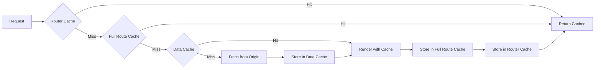

# Data Fetching & Caching

> "There are only two hard things in Computer Science: cache invalidation and naming things." — Phil Karlton

Data fetching in Next.js App Router is fundamentally different from traditional React patterns. Understanding the caching layers, revalidation strategies, and Server Actions is essential for building performant, production-ready applications.

---

## Professional Definition

| Concept | Definition | Why Seniors Care |
|---------|------------|------------------|
| Server-Side Fetch | `fetch()` in Server Components with automatic caching and deduplication | Simpler mental model, no client-side state management for server data |
| Data Cache | Persistent cache storing fetch results across requests and deployments | CDN-level performance for dynamic data |
| Request Memoization | Same fetch calls in one render are deduplicated | Fetch anywhere in component tree without worrying about duplicate requests |
| Revalidation | Strategies to refresh cached data (time-based or on-demand) | Balance between performance (caching) and freshness (latest data) |
| Server Actions | Functions that run on the server, callable from client | Type-safe mutations without building API endpoints |

---

## Simple Explanation (Feynman Backpack Edition)

Imagine a news organization:

1. **Server-Side Fetch** = Reporters (Server Components) gather news directly from sources. They write articles before publishing (rendering).

2. **Request Memoization** = If 5 reporters ask the same source the same question today, the source answers once. Others get copies.

3. **Data Cache** = Published newspapers stored in the archive. Tomorrow's readers get yesterday's paper (cached) unless it's marked "breaking news, reprint!" (revalidation).

4. **Revalidation Strategies:**
   - **Time-based**: "Republish the weather section every hour"
   - **On-demand**: "Breaking news! Reprint page 1 immediately!"

5. **Server Actions** = Readers can mail feedback directly to reporters, who update the next edition. No need for a separate mailroom (API routes).

---

## Fetching Data in Server Components

```tsx
// app/posts/page.tsx - Server Component
async function getPosts() {
  const res = await fetch('https://api.example.com/posts');
  
  if (!res.ok) {
    throw new Error('Failed to fetch posts');
  }
  
  return res.json();
}

export default async function PostsPage() {
  const posts = await getPosts();
  
  return (
    <ul>
      {posts.map((post: Post) => (
        <li key={post.id}>{post.title}</li>
      ))}
    </ul>
  );
}
```

---

## The Four Caching Layers

Next.js has multiple caching layers that work together:



### Layer 1: Request Memoization

Automatically deduplicates identical fetch requests within a single render:

```tsx
// Both components fetch the same URL - only ONE request is made!

// components/Header.tsx (Server Component)
async function Header() {
  const user = await fetch('/api/user').then(r => r.json());
  return <header>Welcome, {user.name}</header>;
}

// components/Sidebar.tsx (Server Component)
async function Sidebar() {
  const user = await fetch('/api/user').then(r => r.json());
  return <aside>{user.name}'s Dashboard</aside>;
}

// app/dashboard/page.tsx
export default function Dashboard() {
  return (
    <>
      <Header />  {/* Fetches /api/user */}
      <Sidebar /> {/* Same URL - uses memoized result */}
    </>
  );
}
```

**Key Points:**
- Only applies to GET requests with `fetch()`
- Only within a single server render
- Automatically enabled, no configuration needed

### Layer 2: Data Cache

Persists fetch results across requests and deployments:

```tsx
// Cached indefinitely (default behavior)
const data = await fetch('https://api.example.com/data');

// Revalidate every 60 seconds
const data = await fetch('https://api.example.com/data', {
  next: { revalidate: 60 }
});

// No caching - always fresh
const data = await fetch('https://api.example.com/data', {
  cache: 'no-store'
});
```

### Layer 3: Full Route Cache

Caches the entire rendered HTML and RSC payload for static routes:

```tsx
// Static route - cached at build time
export default function AboutPage() {
  return <h1>About Us</h1>;
}

// Dynamic route - rendered per request
export const dynamic = 'force-dynamic';

export default async function DashboardPage() {
  const data = await fetchUserData();
  return <Dashboard data={data} />;
}
```

### Layer 4: Router Cache (Client-Side)

Client-side cache of visited routes for instant navigation:

```tsx
// When user navigates /dashboard → /settings → /dashboard
// The second /dashboard visit uses Router Cache

// Force refresh from server:
import { useRouter } from 'next/navigation';

function RefreshButton() {
  const router = useRouter();
  return (
    <button onClick={() => router.refresh()}>
      Refresh Data
    </button>
  );
}
```

---

## Fetch Options Deep Dive

```tsx
// Default: Cache forever (static)
fetch('https://api.example.com/data');

// Equivalent to above
fetch('https://api.example.com/data', { 
  cache: 'force-cache' 
});

// Never cache (dynamic)
fetch('https://api.example.com/data', { 
  cache: 'no-store' 
});

// Time-based revalidation (ISR for data)
fetch('https://api.example.com/data', { 
  next: { revalidate: 3600 } // Refresh every hour
});

// Cache with tags for on-demand revalidation
fetch('https://api.example.com/posts', { 
  next: { tags: ['posts'] }
});

// Combined options
fetch('https://api.example.com/user', {
  next: { 
    revalidate: 300,
    tags: ['user', 'profile']
  },
  headers: {
    'Authorization': `Bearer ${token}`
  }
});
```

---

## Revalidation Strategies

### Time-Based Revalidation

```tsx
// Page-level: revalidate every 60 seconds
export const revalidate = 60;

export default async function NewsPage() {
  const news = await fetch('https://api.example.com/news', {
    next: { revalidate: 60 }
  });
  
  return <NewsList news={await news.json()} />;
}
```

### On-Demand Revalidation

```tsx
// app/api/revalidate/route.ts
import { revalidatePath, revalidateTag } from 'next/cache';
import { NextRequest } from 'next/server';

export async function POST(request: NextRequest) {
  const { path, tag, secret } = await request.json();
  
  // Validate secret
  if (secret !== process.env.REVALIDATION_SECRET) {
    return Response.json({ error: 'Invalid secret' }, { status: 401 });
  }
  
  // Revalidate by path
  if (path) {
    revalidatePath(path);
    return Response.json({ revalidated: true, path });
  }
  
  // Revalidate by tag
  if (tag) {
    revalidateTag(tag);
    return Response.json({ revalidated: true, tag });
  }
  
  return Response.json({ error: 'Path or tag required' }, { status: 400 });
}
```

```tsx
// Usage: Tag your fetches, then revalidate by tag

// In your component
const posts = await fetch('https://api.example.com/posts', {
  next: { tags: ['posts'] }
});

// When content changes (e.g., in CMS webhook)
// POST /api/revalidate { tag: 'posts', secret: '...' }
```

---

## Route Segment Configuration

Control caching at the route level:

```tsx
// app/dashboard/page.tsx

// Force dynamic rendering
export const dynamic = 'force-dynamic';

// Force static rendering (error if can't be static)
export const dynamic = 'force-static';

// Default: auto-detect based on fetch usage
export const dynamic = 'auto';

// Revalidation interval
export const revalidate = 3600; // 1 hour

// Opt into edge runtime
export const runtime = 'edge';

// Prefer rendering at origin
export const preferredRegion = 'auto';
```

---

## Server Actions

Server Actions are functions that run on the server, callable from both Server and Client Components:

### Defining Server Actions

```tsx
// app/actions/posts.ts
'use server';

import { revalidatePath } from 'next/cache';
import { db } from '@/lib/database';

export async function createPost(formData: FormData) {
  const title = formData.get('title') as string;
  const content = formData.get('content') as string;
  
  // Validate
  if (!title || !content) {
    return { error: 'Title and content are required' };
  }
  
  // Create post
  const post = await db.post.create({
    data: { title, content }
  });
  
  // Revalidate the posts list
  revalidatePath('/posts');
  
  return { success: true, post };
}

export async function deletePost(id: string) {
  await db.post.delete({ where: { id } });
  revalidatePath('/posts');
}
```

### Using Server Actions in Forms

```tsx
// app/posts/new/page.tsx (Server Component)
import { createPost } from '@/app/actions/posts';

export default function NewPostPage() {
  return (
    <form action={createPost}>
      <input name="title" placeholder="Title" required />
      <textarea name="content" placeholder="Content" required />
      <button type="submit">Create Post</button>
    </form>
  );
}
```

### Using Server Actions in Client Components

```tsx
'use client';

import { useTransition } from 'react';
import { createPost } from '@/app/actions/posts';

export default function NewPostForm() {
  const [isPending, startTransition] = useTransition();
  
  async function handleSubmit(formData: FormData) {
    startTransition(async () => {
      const result = await createPost(formData);
      if (result.error) {
        alert(result.error);
      }
    });
  }
  
  return (
    <form action={handleSubmit}>
      <input name="title" placeholder="Title" disabled={isPending} />
      <textarea name="content" placeholder="Content" disabled={isPending} />
      <button type="submit" disabled={isPending}>
        {isPending ? 'Creating...' : 'Create Post'}
      </button>
    </form>
  );
}
```

---

## useFormStatus & useFormState

### useFormStatus

```tsx
'use client';

import { useFormStatus } from 'react-dom';

function SubmitButton() {
  const { pending, data, method, action } = useFormStatus();
  
  return (
    <button type="submit" disabled={pending}>
      {pending ? 'Submitting...' : 'Submit'}
    </button>
  );
}

export default function ContactForm() {
  return (
    <form action={submitContactForm}>
      <input name="email" type="email" required />
      <textarea name="message" required />
      <SubmitButton />
    </form>
  );
}
```

### useActionState (React 19)

```tsx
'use client';

import { useActionState } from 'react';
import { createPost } from '@/app/actions/posts';

interface FormState {
  error?: string;
  success?: boolean;
}

export default function PostForm() {
  const [state, formAction, isPending] = useActionState<FormState, FormData>(
    async (prevState, formData) => {
      const result = await createPost(formData);
      return result;
    },
    { error: undefined, success: false }
  );

  return (
    <form action={formAction}>
      {state.error && <p className="error">{state.error}</p>}
      {state.success && <p className="success">Post created!</p>}
      
      <input name="title" required />
      <textarea name="content" required />
      
      <button disabled={isPending}>
        {isPending ? 'Creating...' : 'Create'}
      </button>
    </form>
  );
}
```

---

## useOptimistic

Update UI immediately while the server action runs:

```tsx
'use client';

import { useOptimistic, useTransition } from 'react';
import { likePost } from '@/app/actions/posts';

interface Post {
  id: string;
  title: string;
  likes: number;
}

export default function PostCard({ post }: { post: Post }) {
  const [isPending, startTransition] = useTransition();
  const [optimisticLikes, addOptimisticLike] = useOptimistic(
    post.likes,
    (currentLikes, newLike: number) => currentLikes + newLike
  );

  function handleLike() {
    startTransition(async () => {
      addOptimisticLike(1); // Immediately show +1
      await likePost(post.id); // Actually perform the like
    });
  }

  return (
    <div>
      <h2>{post.title}</h2>
      <button onClick={handleLike} disabled={isPending}>
        ❤️ {optimisticLikes}
      </button>
    </div>
  );
}
```

---

## Parallel vs Sequential Data Fetching

### Sequential (Waterfall) - Avoid When Possible

```tsx
// ❌ Sequential - total time = sum of all fetches
export default async function Dashboard() {
  const user = await fetchUser();        // 200ms
  const posts = await fetchPosts();       // 300ms
  const comments = await fetchComments(); // 250ms
  // Total: ~750ms
  
  return <DashboardView user={user} posts={posts} comments={comments} />;
}
```

### Parallel - Preferred

```tsx
// ✅ Parallel - total time = slowest fetch
export default async function Dashboard() {
  const [user, posts, comments] = await Promise.all([
    fetchUser(),      // 200ms
    fetchPosts(),     // 300ms ← slowest
    fetchComments(),  // 250ms
  ]);
  // Total: ~300ms
  
  return <DashboardView user={user} posts={posts} comments={comments} />;
}
```

### Streaming with Suspense - Best UX

```tsx
// ✅ Streaming - instant initial render, components load independently
import { Suspense } from 'react';

export default function Dashboard() {
  return (
    <div>
      <h1>Dashboard</h1>
      
      <Suspense fallback={<UserSkeleton />}>
        <UserInfo /> {/* Streams in when ready */}
      </Suspense>
      
      <Suspense fallback={<PostsSkeleton />}>
        <PostsList /> {/* Streams in when ready */}
      </Suspense>
      
      <Suspense fallback={<CommentsSkeleton />}>
        <CommentsFeed /> {/* Streams in when ready */}
      </Suspense>
    </div>
  );
}
```

---

## Database Queries (Direct Access)

```tsx
// app/users/page.tsx - Direct database access in Server Component
import { db } from '@/lib/database';

export default async function UsersPage() {
  // No API route needed - query database directly
  const users = await db.user.findMany({
    where: { active: true },
    orderBy: { createdAt: 'desc' },
    take: 10,
  });
  
  return (
    <ul>
      {users.map(user => (
        <li key={user.id}>{user.name}</li>
      ))}
    </ul>
  );
}
```

### With Caching Using `unstable_cache`

```tsx
import { unstable_cache } from 'next/cache';
import { db } from '@/lib/database';

const getCachedUsers = unstable_cache(
  async () => {
    return db.user.findMany({ where: { active: true } });
  },
  ['users-list'], // cache key
  { 
    revalidate: 3600, // 1 hour
    tags: ['users']   // for on-demand revalidation
  }
);

export default async function UsersPage() {
  const users = await getCachedUsers();
  return <UserList users={users} />;
}
```

---

## Error Handling

### Try-Catch Pattern

```tsx
export default async function PostPage({ 
  params 
}: { 
  params: Promise<{ id: string }> 
}) {
  const { id } = await params;
  
  try {
    const post = await fetch(`https://api.example.com/posts/${id}`, {
      cache: 'no-store'
    });
    
    if (!post.ok) {
      throw new Error('Post not found');
    }
    
    return <PostView post={await post.json()} />;
  } catch (error) {
    return <ErrorMessage message="Failed to load post" />;
  }
}
```

### Using error.tsx

```tsx
// app/posts/[id]/error.tsx
'use client';

export default function PostError({
  error,
  reset,
}: {
  error: Error & { digest?: string };
  reset: () => void;
}) {
  return (
    <div>
      <h2>Something went wrong!</h2>
      <p>{error.message}</p>
      <button onClick={reset}>Try again</button>
    </div>
  );
}
```

---

## Senior-Level Interview Prompts & Answers

### 1. "Explain Next.js caching layers and when you'd opt out of each."

**Answer:** Next.js has four caching layers:
1. **Request Memoization** (render-level) - Dedupes identical fetches. Opt out by using POST or different URLs.
2. **Data Cache** (persistent) - Caches fetch results. Opt out with `cache: 'no-store'` for always-fresh data.
3. **Full Route Cache** (build-time) - Caches static pages. Opt out with `dynamic = 'force-dynamic'` or dynamic functions.
4. **Router Cache** (client-side) - Caches visited routes. Clear with `router.refresh()`.

Opt out when data must be real-time (stock prices, live chat) or user-specific (dashboards).

### 2. "When would you use Server Actions vs API Routes?"

**Answer:** 
- **Server Actions**: Mutations tied to UI (form submissions, button clicks). Type-safe, no endpoint to build, automatic revalidation integration.
- **API Routes**: External API consumers, webhooks, long-running jobs, custom auth flows, or when you need RESTful conventions.

Server Actions are the default choice for internal mutations; API routes for external integrations.

### 3. "How do you handle optimistic updates in Next.js?"

**Answer:** Use `useOptimistic` hook:
1. Show the expected result immediately (optimistic state)
2. Start the server action
3. If server succeeds, revalidation updates with real data
4. If server fails, revert optimistic state

This provides instant feedback while maintaining data consistency.

### 4. "What's the difference between revalidatePath and revalidateTag?"

**Answer:**
- `revalidatePath('/posts')`: Invalidates the Full Route Cache for that specific path
- `revalidateTag('posts')`: Invalidates all Data Cache entries tagged with 'posts'

Use paths for route-specific invalidation, tags for data-level invalidation across multiple routes.

---

## Common Pitfalls

| Mistake | Problem | Fix |
|---------|---------|-----|
| Not handling loading states | Poor UX during data fetching | Add `loading.tsx` or Suspense boundaries |
| Sequential fetches | Slow page loads | Use `Promise.all()` or streaming |
| Over-caching dynamic data | Stale data shown to users | Set appropriate `revalidate` or use `no-store` |
| Under-caching static data | Unnecessary server load | Let Next.js cache by default |
| Forgetting to revalidate after mutations | UI shows stale data | Call `revalidatePath` or `revalidateTag` in Server Actions |
| Using `no-store` everywhere | Poor performance | Only opt out of cache when truly needed |
