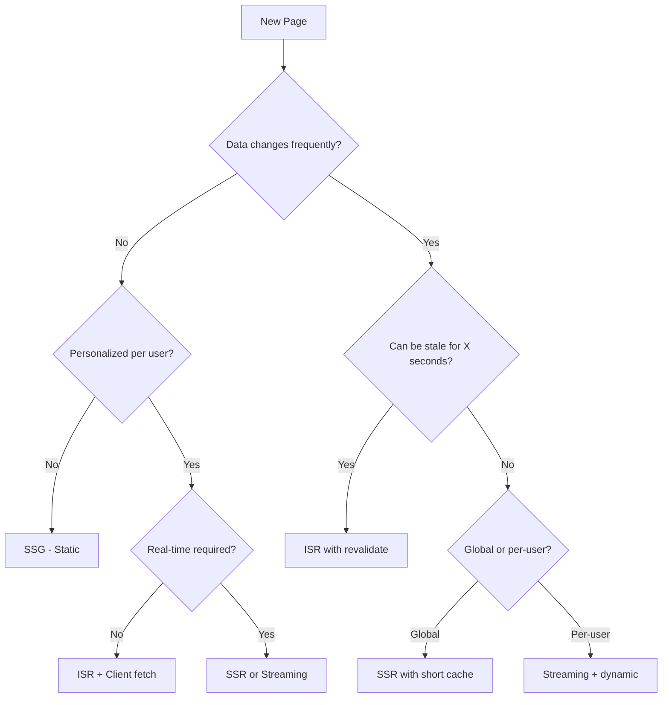
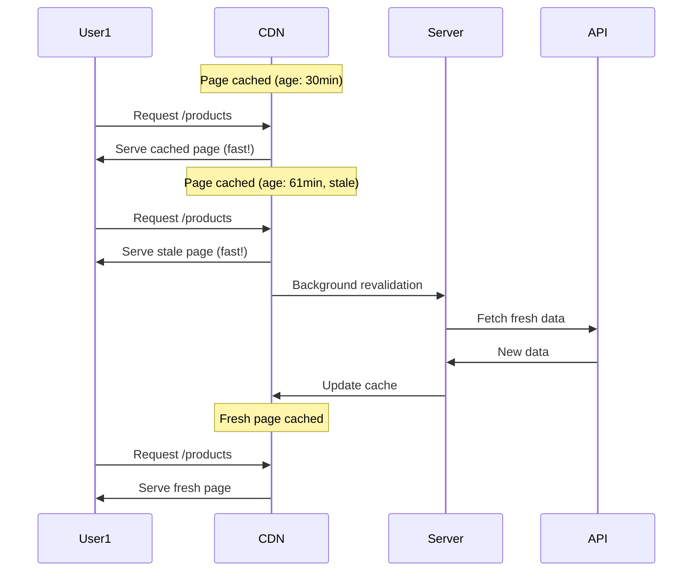

# Rendering Strategies: SSG, SSR, ISR & Streaming

> "Performance is not a feature, it's a survival trait." — Unknown

Next.js offers multiple rendering strategies that can be mixed within a single application. Choosing the right strategy for each page is a core competency for senior engineers—it directly impacts user experience, SEO, and infrastructure costs.

---

## Professional Definition

| Strategy | What It Means | When HTML is Generated |
|----------|---------------|------------------------|
| **SSG** (Static Site Generation) | Pages pre-rendered at build time | Build time |
| **SSR** (Server-Side Rendering) | Pages rendered on each request | Request time |
| **ISR** (Incremental Static Regeneration) | Static pages that can be updated after build | Build + Background revalidation |
| **CSR** (Client-Side Rendering) | Pages rendered in the browser | Runtime (client) |
| **Streaming** | Progressive HTML delivery with Suspense | Request time (incremental) |
| **PPR** (Partial Prerendering) | Static shell + dynamic holes | Build + Request time |

---

## Simple Explanation (Feynman Backpack Edition)

Imagine running a pizza restaurant:

1. **SSG (Static)** = Pre-made pizzas sitting ready. Customer walks in, pizza served instantly. Made fresh every morning (build time).

2. **SSR (Server)** = Made-to-order. Customer orders, kitchen makes it from scratch. Always fresh, but takes time.

3. **ISR (Incremental)** = Pre-made pizzas with auto-refresh. The pepperoni pizza is pre-made, but after 1 hour, next customer triggers a fresh batch in background.

4. **CSR (Client)** = Customer gets dough, sauce, and toppings. They assemble the pizza themselves at their table (browser).

5. **Streaming** = Pizza arrives in slices. First slice (header) arrives immediately, more slices stream in as they're ready.

6. **PPR (Partial)** = Pre-made pizza base with customizable toppings. Base is ready instantly, toppings added per customer preference.

---

## Rendering Decision Flowchart



---

## Static Site Generation (SSG)

Pages are generated at build time and served from CDN:

```tsx
// app/about/page.tsx - Static by default
export default function AboutPage() {
  return (
    <div>
      <h1>About Us</h1>
      <p>We build great software.</p>
    </div>
  );
}
// No data fetching = automatically static
```

### Static with Data

```tsx
// app/blog/page.tsx - Static with fetched data
export default async function BlogPage() {
  // This fetch is cached at build time
  const posts = await fetch('https://api.example.com/posts', {
    cache: 'force-cache' // Default behavior
  }).then(res => res.json());

  return (
    <ul>
      {posts.map((post: Post) => (
        <li key={post.id}>{post.title}</li>
      ))}
    </ul>
  );
}
```

### Generating Static Params

```tsx
// app/blog/[slug]/page.tsx
interface PageProps {
  params: Promise<{ slug: string }>;
}

// Generate static pages for all blog posts at build time
export async function generateStaticParams() {
  const posts = await fetch('https://api.example.com/posts').then(
    res => res.json()
  );
  
  return posts.map((post: Post) => ({
    slug: post.slug,
  }));
}

export default async function BlogPost({ params }: PageProps) {
  const { slug } = await params;
  const post = await fetch(`https://api.example.com/posts/${slug}`).then(
    res => res.json()
  );
  
  return <article>{post.content}</article>;
}
```

### When to Use SSG

| Use Case | Example |
|----------|---------|
| Marketing pages | Homepage, About, Pricing |
| Blog posts | Content that rarely changes |
| Documentation | Technical docs, guides |
| Product listings | E-commerce catalog |
| Legal pages | Terms, Privacy Policy |

**Advantages:**
- Fastest possible load times (CDN-cached)
- Best SEO (complete HTML)
- Lowest server costs
- Works offline (once cached)

**Limitations:**
- Can't show real-time data
- Rebuilds needed for content changes
- Not suitable for personalized content

---

## Server-Side Rendering (SSR)

Pages are rendered on each request:

```tsx
// app/dashboard/page.tsx - Dynamic per request
export const dynamic = 'force-dynamic';

export default async function DashboardPage() {
  const user = await getCurrentUser();
  const data = await fetch(`https://api.example.com/user/${user.id}/dashboard`, {
    cache: 'no-store' // Always fresh
  }).then(res => res.json());
  
  return <Dashboard user={user} data={data} />;
}
```

### Triggering SSR

Any of these make a route dynamic:

```tsx
// 1. Route segment config
export const dynamic = 'force-dynamic';

// 2. Using cache: 'no-store'
fetch(url, { cache: 'no-store' });

// 3. Using dynamic functions
import { cookies, headers } from 'next/headers';

export default async function Page() {
  const cookieStore = await cookies();
  const headersList = await headers();
  // ...
}

// 4. Using searchParams
export default async function Page({ 
  searchParams 
}: { 
  searchParams: Promise<{ q?: string }> 
}) {
  const { q } = await searchParams;
  // ...
}
```

### When to Use SSR

| Use Case | Example |
|----------|---------|
| Personalized dashboards | User-specific data |
| Real-time data | Stock prices, live scores |
| Auth-protected pages | Content behind login |
| Search results | Dynamic queries |
| A/B testing | Different variants per request |

**Advantages:**
- Always shows latest data
- Can personalize per user
- SEO-friendly (server-rendered HTML)
- Can access request headers/cookies

**Limitations:**
- Slower TTFB (Time to First Byte)
- Higher server costs
- Can't leverage CDN caching

---

## Incremental Static Regeneration (ISR)

The best of both worlds: static performance with fresh data:

```tsx
// app/products/page.tsx - Revalidate every hour
export const revalidate = 3600; // seconds

export default async function ProductsPage() {
  const products = await fetch('https://api.example.com/products', {
    next: { revalidate: 3600 }
  }).then(res => res.json());
  
  return <ProductGrid products={products} />;
}
```

### How ISR Works



### On-Demand ISR

Revalidate when content changes (webhook from CMS):

```tsx
// app/api/revalidate/route.ts
import { revalidatePath, revalidateTag } from 'next/cache';
import { NextRequest } from 'next/server';

export async function POST(request: NextRequest) {
  const { secret, path, tag } = await request.json();
  
  if (secret !== process.env.REVALIDATION_SECRET) {
    return Response.json({ error: 'Invalid secret' }, { status: 401 });
  }
  
  if (path) {
    revalidatePath(path);
  }
  
  if (tag) {
    revalidateTag(tag);
  }
  
  return Response.json({ revalidated: true, now: Date.now() });
}
```

### When to Use ISR

| Use Case | Revalidate Time |
|----------|-----------------|
| Blog/News homepage | 60 seconds |
| Product catalog | 5-15 minutes |
| Company directory | 1 hour |
| Documentation | 1 day |
| Analytics dashboards | 30 seconds |

**Advantages:**
- Static-like performance
- Data stays relatively fresh
- Scales well (CDN-cacheable)
- No full rebuild needed

**Limitations:**
- Data can be stale for revalidate period
- First request after revalidation is slow
- Not suitable for real-time or per-user data

---

## Streaming with Suspense

Progressive HTML delivery for better perceived performance:

```tsx
// app/dashboard/page.tsx
import { Suspense } from 'react';

export default function DashboardPage() {
  return (
    <div>
      {/* Renders immediately */}
      <header>
        <h1>Dashboard</h1>
        <Navigation />
      </header>
      
      {/* Streams in when ready */}
      <Suspense fallback={<StatsSkeleton />}>
        <StatsCards /> {/* Async component */}
      </Suspense>
      
      <div className="grid">
        <Suspense fallback={<ChartSkeleton />}>
          <RevenueChart /> {/* Slow - 2s */}
        </Suspense>
        
        <Suspense fallback={<TableSkeleton />}>
          <RecentOrders /> {/* Slow - 1.5s */}
        </Suspense>
      </div>
    </div>
  );
}
```

```tsx
// components/StatsCards.tsx - Async Server Component
async function StatsCards() {
  // This component can be slow - it won't block the page
  const stats = await fetch('https://api.example.com/stats', {
    cache: 'no-store'
  }).then(res => res.json());
  
  return (
    <div className="stats-grid">
      <StatCard title="Revenue" value={stats.revenue} />
      <StatCard title="Users" value={stats.users} />
      <StatCard title="Orders" value={stats.orders} />
    </div>
  );
}
```

### loading.tsx Convention

```tsx
// app/dashboard/loading.tsx
export default function DashboardLoading() {
  return (
    <div className="dashboard-skeleton">
      <div className="header-skeleton" />
      <div className="stats-skeleton" />
      <div className="chart-skeleton" />
    </div>
  );
}
```

### When to Use Streaming

| Use Case | Benefit |
|----------|---------|
| Dashboards with multiple data sources | Independent loading |
| Pages with slow APIs | Show fast content first |
| E-commerce PDPs | Show images before reviews |
| Social feeds | Header before posts load |

**Advantages:**
- Instant perceived performance
- Non-blocking slow components
- Progressive enhancement
- Better Core Web Vitals (FCP)

---

## Partial Prerendering (PPR) - Next.js 14+

Combines static shells with dynamic holes:

```tsx
// next.config.js
const nextConfig = {
  experimental: {
    ppr: true,
  },
};

// app/products/[id]/page.tsx
import { Suspense } from 'react';

export default async function ProductPage({ 
  params 
}: { 
  params: Promise<{ id: string }> 
}) {
  const { id } = await params;
  const product = await fetchProduct(id); // Static - cached at build
  
  return (
    <div>
      {/* Static shell - pre-rendered */}
      <h1>{product.name}</h1>
      <p>{product.description}</p>
      <ProductImages images={product.images} />
      
      {/* Dynamic hole - rendered at request time */}
      <Suspense fallback={<PriceSkeleton />}>
        <DynamicPrice productId={id} />
      </Suspense>
      
      <Suspense fallback={<InventorySkeleton />}>
        <InventoryStatus productId={id} />
      </Suspense>
    </div>
  );
}
```

```tsx
// components/DynamicPrice.tsx
async function DynamicPrice({ productId }: { productId: string }) {
  const price = await fetch(`/api/prices/${productId}`, {
    cache: 'no-store' // Forces dynamic
  }).then(res => res.json());
  
  return <span className="price">${price.current}</span>;
}
```

### How PPR Works

1. Build time: Static shell is pre-rendered (product info, images)
2. Request time: Dynamic holes are filled (price, inventory)
3. Response: Shell served instantly from CDN, holes stream in

```
┌─────────────────────────────────┐
│         STATIC SHELL            │
│  ┌───────────────────────────┐  │
│  │  Product Title            │  │
│  │  Product Description      │  │
│  │  Product Images           │  │
│  └───────────────────────────┘  │
│                                 │
│  ┌─────────────┐ ┌───────────┐  │
│  │ DYNAMIC     │ │ DYNAMIC   │  │
│  │ Price       │ │ Inventory │  │
│  │ (streaming) │ │ (stream)  │  │
│  └─────────────┘ └───────────┘  │
└─────────────────────────────────┘
```

---

## Rendering Strategy Comparison

| Strategy | TTFB | FCP | Data Freshness | SEO | Server Cost |
|----------|------|-----|----------------|-----|-------------|
| SSG | ⚡ Instant | ⚡ Instant | 🔴 Stale (build) | ✅ Excellent | 💰 Lowest |
| ISR | ⚡ Instant | ⚡ Instant | 🟡 Configurable | ✅ Excellent | 💰 Low |
| SSR | 🟡 Slower | 🟡 Slower | ✅ Fresh | ✅ Excellent | 💰💰 Higher |
| Streaming | 🟡 Slower | ⚡ Fast | ✅ Fresh | ✅ Excellent | 💰💰 Higher |
| CSR | ⚡ Fast (empty) | 🔴 Slow | ✅ Fresh | 🔴 Poor | 💰 Low |
| PPR | ⚡ Instant | ⚡ Instant | ✅ Mixed | ✅ Excellent | 💰 Medium |

---

## Mixing Strategies

Real apps use multiple strategies on the same page:

```tsx
// app/store/page.tsx
import { Suspense } from 'react';

export default async function StorePage() {
  // STATIC: Categories never change often
  const categories = await fetch('https://api.example.com/categories', {
    cache: 'force-cache'
  }).then(r => r.json());
  
  // ISR: Products update occasionally
  const featuredProducts = await fetch('https://api.example.com/featured', {
    next: { revalidate: 300 } // 5 minutes
  }).then(r => r.json());
  
  return (
    <div>
      <CategoryNav categories={categories} /> {/* Static */}
      <FeaturedProducts products={featuredProducts} /> {/* ISR */}
      
      <Suspense fallback={<InventorySkeleton />}>
        <LiveInventory /> {/* SSR/Streaming - always fresh */}
      </Suspense>
      
      {/* CSR: User-specific */}
      <RecentlyViewedClient />
    </div>
  );
}
```

---

## Runtime Options

### Node.js Runtime (Default)

```tsx
// Full Node.js APIs available
export const runtime = 'nodejs';

export default async function Page() {
  const fs = require('fs');
  const data = fs.readFileSync('./data.json');
  // ...
}
```

### Edge Runtime

```tsx
// Runs on CDN edge - faster, but limited APIs
export const runtime = 'edge';

export default async function Page() {
  // Web standard APIs only
  // No fs, no native Node.js modules
  const data = await fetch('...');
  return <div>{/* ... */}</div>;
}
```

| Runtime | Cold Start | APIs | Use Case |
|---------|------------|------|----------|
| Node.js | Slower | Full Node.js | Complex backend logic |
| Edge | ~0ms | Web APIs only | Auth, redirects, simple data |

---

## Senior-Level Interview Prompts & Answers

### 1. "How do you choose between SSG, SSR, and ISR?"

**Answer:** Decision framework:
- **SSG**: Content changes infrequently (marketing, docs, blog posts). Best performance and cost.
- **SSR**: Content is personalized or real-time. Accept the performance trade-off for freshness.
- **ISR**: Content changes periodically but staleness is acceptable. Best balance of performance and freshness.

I also consider: SEO requirements (all three are good), caching headers, and whether the page can be CDN-cached.

### 2. "Explain Partial Prerendering and when you'd use it."

**Answer:** PPR combines static and dynamic rendering on the same page. The static shell (layout, navigation, product info) is pre-rendered and served instantly from CDN. Dynamic parts (prices, inventory, personalized content) are streamed in via Suspense boundaries.

Use it for e-commerce product pages (static product info + dynamic pricing), dashboards (static layout + dynamic metrics), or any page with mix of static and personalized content.

### 3. "How does streaming improve user experience?"

**Answer:** Streaming allows the server to send HTML in chunks rather than waiting for everything to be ready. Benefits:
- Lower perceived load time (content appears progressively)
- Non-blocking slow components (fast parts render first)
- Better Core Web Vitals (improved FCP)
- Graceful handling of slow APIs

Implement with Suspense boundaries around slow async components.

### 4. "What's the difference between `cache: 'no-store'` and `dynamic = 'force-dynamic'`?"

**Answer:**
- `cache: 'no-store'` on fetch: That specific fetch is not cached, but other fetches in the component may still be cached.
- `dynamic = 'force-dynamic'` on route: The entire route is rendered per-request, opting out of Full Route Cache.

Use `cache: 'no-store'` for granular control of individual data sources. Use `dynamic = 'force-dynamic'` when the entire page must be dynamic.

---

## Common Pitfalls

| Mistake | Problem | Fix |
|---------|---------|-----|
| SSR everything | Slow, expensive | Default to static, opt-in to dynamic |
| ISR with 0 revalidate | Same as SSR, but worse | Use `cache: 'no-store'` for truly dynamic |
| No Suspense boundaries | All-or-nothing loading | Wrap slow components in Suspense |
| Ignoring TTFB | Poor user experience | Use streaming for slow pages |
| Static pages with cookies | Build errors or stale data | Use middleware or client components |
| forgetting `generateStaticParams` | 404 on dynamic routes in static export | Generate all valid params |
