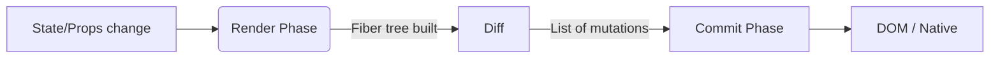

# React Foundations & Rendering Model

> "What I cannot build, I do not understand." — Richard Feynman

React’s value isn’t in JSX magic tricks. It’s the disciplined mental model for **describing UI as a pure projection of state**, and then letting the runtime (Fiber) turn that description into pixels with surgical efficiency. Master the model and you can reason about any React codebase from first principles.

---

## Professional Definition

React is a declarative UI library built around three guarantees:

| Layer | Professional Definition | What Senior Engineers Actually Care About |
|-------|-------------------------|-------------------------------------------|
| Elements | Plain objects describing *what* the UI should look like (`type`, `props`, `key`). | Stable shape enables diffing, serialization, server rendering. |
| Fiber | Persistent data structure representing a unit of work in the render tree. | Gives React fine-grained scheduling, interruption, and prioritization. |
| Renderer | Host-specific implementation (DOM, React Native, custom). | Controls actual side-effects: DOM mutations, layout, platform APIs. |

---

## Simple Explanation (Feynman Backpack Edition)

1. **You write JSX** → like sketching a picture of the UI.
2. **React converts it to elements** → think of these as *instructions*.
3. **Fiber reads the instructions** → it’s the construction supervisor that decides what to work on next.
4. **The renderer (DOM)** → skilled workers actually lay bricks, wire buttons, etc.

If state changes, you just hand React an updated sketch. Fiber re-plans the renovation so only the rooms that changed are touched.

---

## Rendering Pipeline (React 18+ & 19)

| Phase | Description | What Runs | Can Be Interrupted? |
|-------|-------------|-----------|----------------------|
| Render (a.k.a. Reconciliation) | Build a new Fiber tree from your latest JSX and state. | Function components, hooks, derived props. | ✅ Yes (Concurrent React) |
| Diff | Compare previous Fiber tree to the new one. | Child reconciliation, key matching, effect preparation. | ✅ Yes |
| Commit | Apply mutations to the host environment. Split into Before Mutation, Mutation, Layout sub-phases. | DOM updates, ref callbacks, lifecycle effects. | ❌ No |

**React 19 update:** The new React Compiler (opt-in 2025) precomputes hook dependencies so React can skip renders even more aggressively.



---

## JSX & Elements Under the Hood

```jsx
function Button({ label }) {
  return <button className="btn">{label}</button>;
}

// Transforms to:
function Button(props) {
  return React.createElement("button", { className: "btn" }, props.label);
}
```

- `React.createElement` returns a plain object: `{ type: "button", props: {...}, key: null }`.
- During render, Fiber clones that object into a working unit with metadata (lanes, flags, child pointers).

**Senior takeaway:** Treat JSX as compile-time sugar. You can always drop to `React.createElement` when debugging serialization or SSR boundaries.

---

## Reconciliation Rules You Must Recite

1. **Identity comes from `type` + `key`.**
   - If either changes, Fiber discards the subtree and remounts it.
2. **Sibling arrays are diffed left-to-right.**
   - Missing keys incur O(n²) churn on lists. Always supply stable keys derived from business identifiers.
3. **Effects attach to fibers.**
   - React won’t run `useEffect` cleanup if the component was never committed.

```jsx
// ❌ Anti-pattern: index keys cause remounts when order changes
items.map((item, index) => <Card key={index} data={item} />);

// ✅ Use primary keys
items.map((item) => <Card key={item.id} data={item} />);
```

---

## Fiber Internals (2025 Snapshot)

| Field | Purpose |
|-------|---------|
| `tag` | Component type (function, host component, Suspense, etc.). |
| `pendingProps` / `memoizedProps` | Props for the current render vs last committed render. |
| `lanes` | Priority lanes; scheduler uses them to decide which updates can be interrupted. |
| `flags` | Bitmask describing work to perform in the commit phase (Placement, Update, Deletion, etc.). |
| `child`, `sibling`, `return` | Linked-list pointers for traversal. |

React 19 introduced *transition tracing* in DevTools, letting you see lanes, priorities, and pending transitions for each Fiber. Use it to explain why a supposedly "stuck" component isn't rendering—it might be intentionally deferred.

---

## Event System (Synthetic Events)

1. React registers a single event listener per event type on the root (capture + bubble).
2. Events are normalized into SyntheticEvents with consistent APIs.
3. Starting React 17, events bubble through the React tree, not the DOM tree, enabling portals and off-root rendering.

```jsx
function List({ items }) {
  function handleClick(event) {
    event.preventDefault(); // Works even on custom elements
  }
  return (
    <ul onClick={handleClick}>
      {items.map((item) => (
        <li key={item.id}>{item.label}</li>
      ))}
    </ul>
  );
}
```

**Production tip:** Since React 17, synthetic events are no longer pooled, so you can safely access event properties asynchronously. In older versions, you needed `event.persist()` or destructuring values before `await`.

---

## Limitations & Caveats

1. **Render ≠ Commit:** Logging DOM in render will always be stale. Wait until layout effects or use refs.
2. **Context storms:** Every context value change re-renders all consumers. Use selectors (`use-context-selector` or custom context with split providers) for granular updates.
3. **Layout Thrashing:** React won’t protect you from reading layout before writes. Use `useLayoutEffect` sparingly and batch DOM reads before writes.
4. **Event batching boundaries:** Since React 18, updates inside native promises *are* batched. Outside React (e.g., `setTimeout`), call `flushSync` only when you need imperative ordering.
5. **Hydration mismatch traps:** JSX must be deterministic between server and client. Avoid reading `Date.now()` or random IDs during render; use `useEffect` or lazy initial state.

---

## Senior-Level Interview Prompts & Answers

1. **“Walk me through an update when `setState` is called.”**
   - Explain update lane assignment, scheduling on the root Fiber, render phase work loop, bailouts, and commit priority.
2. **“Why did React build Fiber?”**
   - To break synchronous rendering, enabling features like Suspense, concurrent rendering, selective hydration, and better error recovery.
3. **“How does React reconcile portals?”**
   - Portals participate in the same Fiber tree even if DOM nodes live elsewhere; events still bubble through the virtual tree.
4. **“When do you prefer controlled vs uncontrolled inputs?”**
   - Controlled for validation, analytics, autosave. Uncontrolled (refs) for large forms where perf matters; rely on `FormData`.

---

## Senior Engineer Checklist

- [ ] I can sketch the render → commit pipeline without notes.
- [ ] I know how to debug hydration mismatches (DevTools overlay, `suppressHydrationWarning` only as last resort).
- [ ] I default to stable keys and understand when `key` changes remount state.
- [ ] I leverage React DevTools Profiler to see lanes and transitions before touching code.
- [ ] I can explain why React is a library (not a framework) and what the host renderer abstraction enables (e.g., React Three Fiber, Ink).

Master these foundations and the rest of the React ecosystem becomes a question of composition, not memorization.
