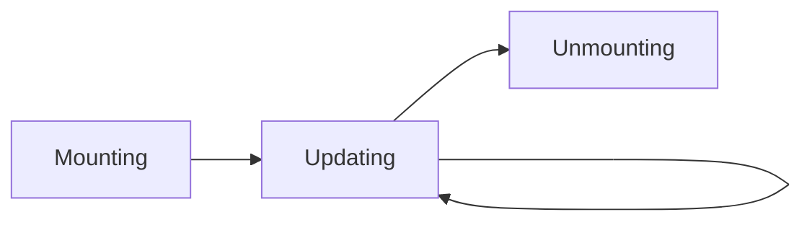
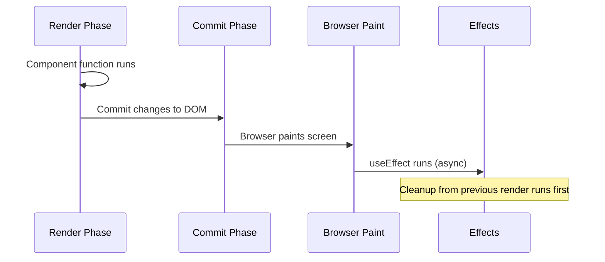

# Component Lifecycle: From Classes to Hooks

> "First, solve the problem. Then, write the code." — John Johnson

Understanding React's component lifecycle is fundamental to building reliable applications. Whether you're maintaining legacy class components or writing modern functional components with hooks, the lifecycle concepts remain the same—only the API differs.

---

## The Three Phases of React Lifecycle

Every React component goes through three main phases:

| Phase | Description | When It Happens |
|-------|-------------|-----------------|
| **Mounting** | Component is being created and inserted into the DOM | Initial render |
| **Updating** | Component is being re-rendered due to state/props changes | Any state or prop change |
| **Unmounting** | Component is being removed from the DOM | Component removed from tree |



---

## Class Component Lifecycle (Legacy but Still Used)

Class components have explicit lifecycle methods that fire at specific points:

### Mounting Phase

```jsx
class UserProfile extends React.Component {
  constructor(props) {
    super(props);
    this.state = { user: null };
    // ✅ Initialize state, bind methods
    // ❌ Don't call setState here
  }

  static getDerivedStateFromProps(props, state) {
    // Rarely needed - sync state from props
    // Return object to update state, or null
    if (props.userId !== state.prevUserId) {
      return { prevUserId: props.userId, user: null };
    }
    return null;
  }

  componentDidMount() {
    // ✅ Perfect for: API calls, subscriptions, DOM manipulation
    this.fetchUser(this.props.userId);
    this.subscription = api.subscribe(this.handleUpdate);
  }

  render() {
    // Pure function - return JSX based on props and state
    return <div>{this.state.user?.name}</div>;
  }
}
```

### Updating Phase

```jsx
class UserProfile extends React.Component {
  static getDerivedStateFromProps(props, state) {
    // Called before every render (mount and update)
    return null;
  }

  shouldComponentUpdate(nextProps, nextState) {
    // Performance optimization - return false to skip render
    // ⚠️ Use PureComponent or React.memo instead
    return nextProps.userId !== this.props.userId;
  }

  getSnapshotBeforeUpdate(prevProps, prevState) {
    // Capture DOM info before it changes (e.g., scroll position)
    // Return value passed to componentDidUpdate
    if (prevProps.items.length < this.props.items.length) {
      return this.listRef.scrollHeight;
    }
    return null;
  }

  componentDidUpdate(prevProps, prevState, snapshot) {
    // ✅ Perfect for: Reacting to prop/state changes
    // ⚠️ Always wrap setState in a condition to avoid infinite loops
    if (prevProps.userId !== this.props.userId) {
      this.fetchUser(this.props.userId);
    }

    // Use snapshot from getSnapshotBeforeUpdate
    if (snapshot !== null) {
      this.listRef.scrollTop += this.listRef.scrollHeight - snapshot;
    }
  }

  render() {
    return <div ref={(el) => (this.listRef = el)}>{/* content */}</div>;
  }
}
```

### Unmounting Phase

```jsx
class UserProfile extends React.Component {
  componentWillUnmount() {
    // ✅ Cleanup: cancel requests, remove subscriptions, clear timers
    this.subscription.unsubscribe();
    clearInterval(this.timer);
    this.abortController.abort();

    // ❌ Don't call setState here - component is being removed
  }
}
```

### Error Handling

```jsx
class ErrorBoundary extends React.Component {
  state = { hasError: false };

  static getDerivedStateFromError(error) {
    // Update state to show fallback UI
    return { hasError: true };
  }

  componentDidCatch(error, errorInfo) {
    // Log error to monitoring service
    logErrorToService(error, errorInfo.componentStack);
  }

  render() {
    if (this.state.hasError) {
      return <h1>Something went wrong.</h1>;
    }
    return this.props.children;
  }
}
```

---

## Complete Class Lifecycle Diagram

```
┌─────────────────────────────────────────────────────────────────────────┐
│                            MOUNTING                                      │
├─────────────────────────────────────────────────────────────────────────┤
│  constructor()                                                           │
│       ↓                                                                  │
│  static getDerivedStateFromProps()                                       │
│       ↓                                                                  │
│  render()                                                                │
│       ↓                                                                  │
│  componentDidMount()  ← API calls, subscriptions, DOM access            │
└─────────────────────────────────────────────────────────────────────────┘
                              ↓
┌─────────────────────────────────────────────────────────────────────────┐
│                            UPDATING                                      │
├─────────────────────────────────────────────────────────────────────────┤
│  static getDerivedStateFromProps()                                       │
│       ↓                                                                  │
│  shouldComponentUpdate()  ← Performance gate                            │
│       ↓                                                                  │
│  render()                                                                │
│       ↓                                                                  │
│  getSnapshotBeforeUpdate()  ← Capture pre-update DOM state              │
│       ↓                                                                  │
│  componentDidUpdate()  ← React to changes, conditional setState         │
└─────────────────────────────────────────────────────────────────────────┘
                              ↓
┌─────────────────────────────────────────────────────────────────────────┐
│                           UNMOUNTING                                     │
├─────────────────────────────────────────────────────────────────────────┤
│  componentWillUnmount()  ← Cleanup subscriptions, timers, requests      │
└─────────────────────────────────────────────────────────────────────────┘
```

---

## Functional Components with Hooks (Modern Approach)

Hooks replace class lifecycle methods with a more composable model:

### useEffect: The Universal Lifecycle Hook

```jsx
function UserProfile({ userId }) {
  const [user, setUser] = useState(null);

  // 🔄 Runs after every render (like componentDidMount + componentDidUpdate)
  useEffect(() => {
    console.log("Component rendered");
  });

  // 📌 Runs once on mount (like componentDidMount)
  useEffect(() => {
    console.log("Component mounted");
  }, []);

  // 🎯 Runs when userId changes (like componentDidUpdate with condition)
  useEffect(() => {
    fetchUser(userId).then(setUser);
  }, [userId]);

  // 🧹 Cleanup function (like componentWillUnmount)
  useEffect(() => {
    const subscription = api.subscribe(userId);

    return () => {
      // This runs before the next effect or on unmount
      subscription.unsubscribe();
    };
  }, [userId]);

  return <div>{user?.name}</div>;
}
```

### Lifecycle Mapping: Classes to Hooks

| Class Method | Hook Equivalent |
|--------------|-----------------|
| `constructor` | `useState` initial value, or run code before first `return` |
| `componentDidMount` | `useEffect(() => {}, [])` with empty deps |
| `componentDidUpdate` | `useEffect(() => {}, [deps])` with dependencies |
| `componentWillUnmount` | `useEffect` cleanup function `return () => {}` |
| `shouldComponentUpdate` | `React.memo()` wrapper |
| `getDerivedStateFromProps` | Update state during render (rare) |
| `getSnapshotBeforeUpdate` | `useLayoutEffect` + refs |
| `componentDidCatch` | No hook equivalent—use class Error Boundaries |

---

## useEffect Execution Timeline

Understanding **when** effects run is crucial:

```jsx
function Example({ id }) {
  console.log("1. Render start");

  useEffect(() => {
    console.log("4. Effect runs (after paint)");
    return () => console.log("3. Cleanup previous effect");
  }, [id]);

  console.log("2. Render end");
  return <div>ID: {id}</div>;
}

// On mount (id = 1):
// 1. Render start
// 2. Render end
// (browser paints)
// 4. Effect runs

// On update (id changes to 2):
// 1. Render start
// 2. Render end
// (browser paints)
// 3. Cleanup previous effect
// 4. Effect runs
```



---

## useLayoutEffect: Synchronous Effects

When you need to measure or mutate DOM **before** the browser paints:

```jsx
function Tooltip({ targetRef }) {
  const tooltipRef = useRef();
  const [position, setPosition] = useState({ top: 0, left: 0 });

  // 🎨 Runs BEFORE browser paint - no visual flicker
  useLayoutEffect(() => {
    const targetRect = targetRef.current.getBoundingClientRect();
    const tooltipRect = tooltipRef.current.getBoundingClientRect();

    setPosition({
      top: targetRect.bottom + 8,
      left: targetRect.left + (targetRect.width - tooltipRect.width) / 2,
    });
  }, [targetRef]);

  return (
    <div ref={tooltipRef} style={{ position: "absolute", ...position }}>
      Tooltip content
    </div>
  );
}
```

### useEffect vs useLayoutEffect

| Aspect | `useEffect` | `useLayoutEffect` |
|--------|-------------|-------------------|
| When it runs | After browser paint (async) | Before browser paint (sync) |
| Blocks paint | ❌ No | ✅ Yes |
| Use case | Data fetching, subscriptions, logging | DOM measurements, preventing flicker |
| Performance | Better (non-blocking) | Can cause jank if slow |

**Rule of thumb:** Always start with `useEffect`. Only use `useLayoutEffect` when you see visual flicker or need pre-paint DOM access.

---

## Common Patterns & Best Practices

### 1. Data Fetching with Cleanup

```jsx
function UserData({ userId }) {
  const [user, setUser] = useState(null);
  const [loading, setLoading] = useState(true);
  const [error, setError] = useState(null);

  useEffect(() => {
    let cancelled = false;
    const controller = new AbortController();

    async function fetchData() {
      setLoading(true);
      setError(null);

      try {
        const response = await fetch(`/api/users/${userId}`, {
          signal: controller.signal,
        });
        const data = await response.json();

        if (!cancelled) {
          setUser(data);
        }
      } catch (err) {
        if (!cancelled && err.name !== "AbortError") {
          setError(err.message);
        }
      } finally {
        if (!cancelled) {
          setLoading(false);
        }
      }
    }

    fetchData();

    return () => {
      cancelled = true;
      controller.abort();
    };
  }, [userId]);

  if (loading) return <Spinner />;
  if (error) return <Error message={error} />;
  return <Profile user={user} />;
}
```

### 2. Event Listeners

```jsx
function WindowSize() {
  const [size, setSize] = useState({
    width: window.innerWidth,
    height: window.innerHeight,
  });

  useEffect(() => {
    function handleResize() {
      setSize({
        width: window.innerWidth,
        height: window.innerHeight,
      });
    }

    window.addEventListener("resize", handleResize);

    return () => {
      window.removeEventListener("resize", handleResize);
    };
  }, []); // Empty deps - only set up once

  return (
    <span>
      {size.width} x {size.height}
    </span>
  );
}
```

### 3. Interval/Timer with Refs

```jsx
function Timer() {
  const [count, setCount] = useState(0);
  const savedCallback = useRef();

  // Remember the latest callback
  useEffect(() => {
    savedCallback.current = () => setCount((c) => c + 1);
  });

  // Set up the interval
  useEffect(() => {
    function tick() {
      savedCallback.current();
    }

    const id = setInterval(tick, 1000);
    return () => clearInterval(id);
  }, []); // Empty deps - interval set once

  return <h1>{count}</h1>;
}
```

### 4. Previous Value Pattern

```jsx
function usePrevious(value) {
  const ref = useRef();

  useEffect(() => {
    ref.current = value;
  }, [value]);

  return ref.current; // Returns previous value (before update)
}

function Counter() {
  const [count, setCount] = useState(0);
  const prevCount = usePrevious(count);

  return (
    <div>
      Now: {count}, Before: {prevCount}
      <button onClick={() => setCount(count + 1)}>+1</button>
    </div>
  );
}
```

---

## Strict Mode Double Invocation

React 18+ StrictMode intentionally double-invokes effects in development:

```jsx
useEffect(() => {
  console.log("Effect runs"); // Logs twice in dev mode
  const connection = createConnection();
  connection.connect();

  return () => {
    console.log("Cleanup runs"); // Also runs to test cleanup
    connection.disconnect();
  };
}, []);
```

**Why?** To catch bugs where cleanup is missing or effects aren't idempotent.

```jsx
// ❌ Broken - doesn't handle double-invoke
useEffect(() => {
  items.push(newItem); // Adds item twice in StrictMode
}, []);

// ✅ Fixed - idempotent
useEffect(() => {
  if (!items.includes(newItem)) {
    items.push(newItem);
  }
}, []);
```

---

## Anti-Patterns to Avoid

### 1. Missing Dependencies

```jsx
// ❌ Bug: stale closure - count is always 0
useEffect(() => {
  const id = setInterval(() => {
    setCount(count + 1); // count captured at mount time
  }, 1000);
  return () => clearInterval(id);
}, []);

// ✅ Fix: use functional update
useEffect(() => {
  const id = setInterval(() => {
    setCount((c) => c + 1); // Always uses latest value
  }, 1000);
  return () => clearInterval(id);
}, []);
```

### 2. Object/Array in Dependencies

```jsx
// ❌ Bug: infinite loop - new object every render
function Component({ userId }) {
  const options = { userId, format: "full" }; // New reference each render

  useEffect(() => {
    fetchUser(options);
  }, [options]); // Always different!
}

// ✅ Fix: memoize or use primitive deps
function Component({ userId }) {
  const options = useMemo(() => ({ userId, format: "full" }), [userId]);

  useEffect(() => {
    fetchUser(options);
  }, [options]);
}

// ✅ Even better: use primitives directly
useEffect(() => {
  fetchUser({ userId, format: "full" });
}, [userId]);
```

### 3. Synchronizing Derived State

```jsx
// ❌ Anti-pattern: useEffect for derived state
const [items, setItems] = useState([]);
const [filteredItems, setFilteredItems] = useState([]);

useEffect(() => {
  setFilteredItems(items.filter((i) => i.active));
}, [items]);

// ✅ Fix: compute during render
const [items, setItems] = useState([]);
const filteredItems = items.filter((i) => i.active);

// Or memoize if expensive
const filteredItems = useMemo(
  () => items.filter((i) => i.active),
  [items]
);
```

---

## Quick Reference Card

```
┌─────────────────────────────────────────────────────────────────────┐
│                    LIFECYCLE QUICK REFERENCE                         │
├─────────────────────────────────────────────────────────────────────┤
│                                                                      │
│  MOUNT ONCE:           useEffect(() => { ... }, [])                  │
│                                                                      │
│  ON CHANGE:            useEffect(() => { ... }, [dep1, dep2])        │
│                                                                      │
│  EVERY RENDER:         useEffect(() => { ... })                      │
│                                                                      │
│  CLEANUP:              useEffect(() => {                             │
│                          return () => { /* cleanup */ }              │
│                        }, [deps])                                    │
│                                                                      │
│  BEFORE PAINT:         useLayoutEffect(() => { ... }, [deps])        │
│                                                                      │
│  ERROR BOUNDARY:       Use class component with componentDidCatch    │
│                                                                      │
└─────────────────────────────────────────────────────────────────────┘
```

---

## Interview Questions

### Q1: What's the difference between useEffect and useLayoutEffect?
**A:** `useEffect` runs asynchronously after the browser paints, making it non-blocking. `useLayoutEffect` runs synchronously before the browser paints, blocking visual updates. Use `useLayoutEffect` only when you need to measure/mutate DOM before the user sees changes (e.g., tooltips, animations).

### Q2: How do you prevent memory leaks in useEffect?
**A:** Return a cleanup function that cancels subscriptions, clears timers, and aborts fetch requests:
```jsx
useEffect(() => {
  const controller = new AbortController();
  fetch(url, { signal: controller.signal });
  return () => controller.abort();
}, [url]);
```

### Q3: Why does useEffect run twice in development?
**A:** React 18's StrictMode intentionally double-invokes effects to help you find bugs where cleanup is missing or effects have side effects that aren't properly reset.

### Q4: Can you use async/await directly in useEffect?
**A:** No, useEffect expects a cleanup function or undefined. Wrap async code in an inner function:
```jsx
useEffect(() => {
  async function fetchData() {
    const result = await api.get(id);
    setData(result);
  }
  fetchData();
}, [id]);
```

### Q5: What lifecycle method has no hook equivalent?
**A:** `componentDidCatch` and `getDerivedStateFromError`. Error boundaries must still be class components (as of React 19).
