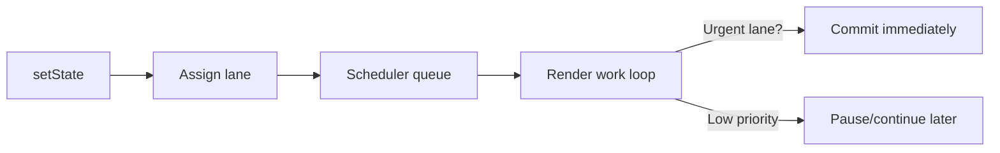

# Concurrent React, Suspense, and Transitions

> “Performance is user experience.” — Addy Osmani

React’s concurrent features are about **prioritizing work**, not making components faster by magic. Think of React as a control tower: urgent updates (user input) must land immediately; non-urgent flights (complex filtering, data fetches) can circle until the runway is free.

---

## Concurrent Rendering: Professional Definition

Concurrent rendering lets React start rendering a new tree **without blocking** the UI thread. If a more urgent update arrives, React can pause or abandon the work and pick it up later.

Key pieces:

| Concept | Meaning |
|---------|---------|
| Lanes | Priority buckets for updates (e.g., Sync Lane, Transition Lane). |
| Work Loop | The scheduler that processes fibers according to lane priority. |
| Interruptible Render | Function components can be paused midway; effects only run after commit. |

**React 19 update:** Async transitions can `await` inside `startTransition`. Suspense boundaries integrate with streaming SSR and form actions.

---

## Scheduler Anatomy

React uses the Scheduler package (cooperatively scheduled on the main thread):

1. Each update gets a lane (priority).
2. Scheduler queues callbacks with deadlines (when they should finish).
3. Browser yields control back to React via `MessageChannel` or `postTask`.
4. React executes units of work (fibers) until it needs to yield or the work completes.



---

## useTransition and startTransition

```jsx
const [isPending, startTransition] = useTransition();

function handleChange(event) {
  const nextValue = event.target.value;
  setInput(nextValue); // urgent
  startTransition(() => {
    setSearchQuery(nextValue); // non-urgent
  });
}
```

- `isPending`: true while the transition work is rendering.
- React deprioritizes the transition so typing stays snappy.
- In React 19, you can `await` inside transitions:

```jsx
startTransition(async () => {
  const data = await action(formData);
  setServerResult(data);
});
```

---

## useDeferredValue

```jsx
const deferredQuery = useDeferredValue(query);

const suggestions = useMemo(() => filterItems(deferredQuery), [deferredQuery]);
```

`useDeferredValue` keeps the old value until the low-priority render completes. Great for filtering or expensive derived computations.

---

## Suspense Fundamentals

Suspense lets components **throw promises** to indicate they’re waiting for data. React catches the promise, shows the nearest fallback, and resumes when the promise resolves.

```jsx
function UserProfile({ id }) {
  const user = useUserResource(id); // throws promise while loading
  return <h1>{user.name}</h1>;
}

function App() {
  return (
    <Suspense fallback={<Spinner />}>
      <UserProfile id="1" />
    </Suspense>
  );
}
```

**Key behaviors:**

1. Rendering continues around the suspended subtree.
2. Fallback UI is scoped (per Suspense boundary).
3. Suspense integrates with transitions for pending indicators.

---

## Suspense + Transitions Pattern

```jsx
const [resource, setResource] = useState(initialResource);
const [isPending, startTransition] = useTransition();

function handleRefresh() {
  startTransition(() => {
    setResource(fetchUserResource());
  });
}

return (
  <>
    <button onClick={handleRefresh} disabled={isPending}>
      Refresh {isPending && "…"}
    </button>
    <Suspense fallback={<Skeleton />}>
      <Profile resource={resource} />
    </Suspense>
  </>
);
```

- The button stays responsive.
- Suspense shows `Skeleton` only for the profile, not the entire page.

---

## Server Components & Actions (React 19)

1. **Server Components (RSC):** Components that run on the server, can access databases/files, and stream rendered output to the client without shipping the code.
2. **Actions:** `async function action(formData) {}` definitions (either server or client) that integrate with Suspense and transitions automatically.

```jsx
// app/actions.js (Server)
export async function createPost(formData) {
  "use server";
  await db.post.create({ title: formData.get("title") });
}

// component
import { createPost } from "./actions";
import { useActionState } from "react";

export function PostForm() {
  const [state, formAction, isPending] = useActionState(createPost, null);

  return (
    <form action={formAction}>
      <input name="title" />
      <button disabled={isPending}>Create</button>
      {state?.error && <p>{state.error}</p>}
    </form>
  );
}
```

React automatically shows pending UI, handles errors, and revalidates server state via streaming.

---

## Streaming SSR & Selective Hydration

React can stream HTML in chunks:

1. Server renders components until it hits a Suspense boundary.
2. Sends the fallback immediately.
3. Continues rendering the suspended component; when done, streams the final HTML and hydrates it client-side.

**Benefits:**

- Faster Time to First Byte and Time to Interactive.
- Hydration can happen out-of-order; the client hydrates more critical parts first.

Use `<Suspense fallback={<Shell />}>` around slow server components to get progressive rendering for free.

---

## Tracing & DevTools

React DevTools (v5.0+) includes:

- **Profiler lanes view:** Visualizes which updates ran in which lane (Sync, Transition, Idle).
- **Scheduler tracing:** Shows the type of work, priority, and durations.
- **Suspense toggle:** See where components suspended and for how long.

Use the Profiler when debugging “why is this slow?” before rewriting components.

---

## Limitations & Gotchas

1. **Concurrent rendering isn’t multi-threaded.** JavaScript is still single-threaded; React just schedules work cooperatively.
2. **Side effects must remain pure.** React might abandon renders halfway. Don’t cause side effects during render (e.g., logging, imperative DOM writes).
3. **startTransition doesn’t delay commits.** It only deprioritizes renders. If the transition updates the same state as urgent work, the urgent update wins.
4. **Suspense boundaries require fallback UI readiness.** Always design meaningful fallbacks (skeletons, loading states) for each region.
5. **Concurrent features need React 18+.** Some libraries may need updates to be concurrent-safe (no reliance on render counts, no mutation during render).

---

## Interview & Senior Discussion Topics

| Question | High-Signal Answer Points |
|----------|---------------------------|
| “When would you use startTransition?” | On updates triggered by user input that may take time to render (filters, tree views). Keep urgent state (input value) outside transitions. |
| “Does Suspense replace error boundaries?” | No. Suspense handles loading states, while error boundaries catch runtime errors. Both can be nested to isolate failures. |
| “How do React Server Components reduce bundle size?” | Server components run on the server; their code isn’t sent to the client. Only the serialized payload is streamed, reducing JS shipped to browsers. |
| “How do you debug a Suspense waterfall?” | Enable React DevTools Profiler to view suspends, use `React.SuspenseList`, and co-locate data requirements (React Query’s `suspense: true`). |

---

## Checklist

- [ ] Transitions wrap non-urgent updates; urgent ones stay snappy.
- [ ] Suspense boundaries placed around async regions with tailored fallbacks.
- [ ] DevTools profiler used to confirm lane priorities before optimizing.
- [ ] SSR uses streaming & selective hydration (where supported) for faster interactivity.
- [ ] Actions and async transitions adopted for forms / server mutations (React 19+).

Master concurrency and Suspense, and you’ll deliver fast, resilient experiences that scale from laptops to low-powered devices without hacks.
