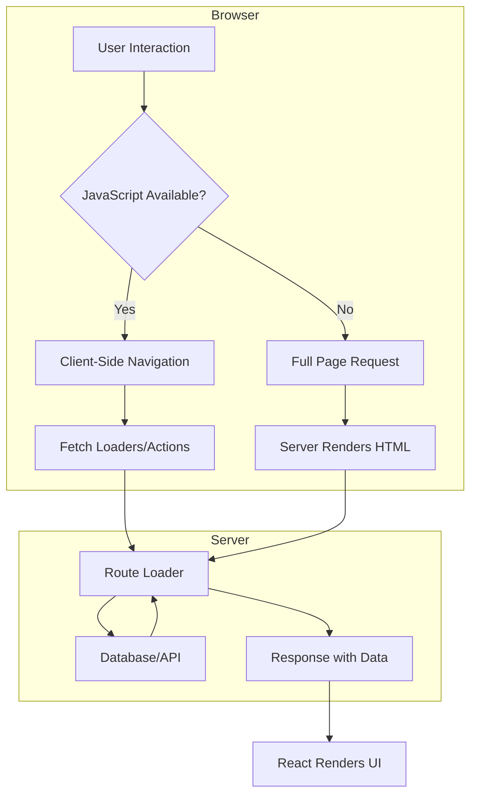

# Remix Foundations & Core Concepts

> "The best code is the code that doesn't need to exist." — Kent C. Dodds (Remix Co-Creator)

Remix is a full-stack web framework that embraces web fundamentals while providing a modern developer experience. Built on top of React Router, it focuses on progressive enhancement, server-side rendering, and the web platform's native capabilities.

---

## Professional Definition

Remix is a full-stack React framework built on web standards:

| Layer | Professional Definition | What Senior Engineers Actually Care About |
|-------|-------------------------|-------------------------------------------|
| Web Standards | Uses native web APIs (Fetch, Request, Response, FormData) | Portable code, no vendor lock-in, skills transfer to any web platform |
| Nested Routing | Routes define both data and UI hierarchy | Parallel data loading, isolated error boundaries, optimal UX |
| Progressive Enhancement | Apps work without JavaScript, then enhance | Resilient apps that work on flaky networks, accessibility by default |
| Server-First | Business logic lives on server, UI on client | Security, smaller bundles, direct database access |
| React Router Foundation | Built on React Router 6+ | Familiar API, migration path, battle-tested routing |

---

## Simple Explanation (Feynman Backpack Edition)

Imagine you're building a restaurant:

1. **Traditional SPAs** = All cooking happens at the customer's table. You ship them raw ingredients (JavaScript) and hope they have a stove (good device/network).

2. **Next.js SSG/ISR** = You pre-cook dishes and vacuum-seal them. Fast to serve, but updating the menu requires rebuilding the kitchen.

3. **Remix** = A proper restaurant. The kitchen (server) cooks when orders come in. Waiters (loaders) fetch dishes. Customers (users) get hot food fast. If the stove breaks (JS fails), you can still serve cold dishes (HTML works without JS).

The philosophy: **Use the platform**. Browsers know how to submit forms, handle navigation, and cache resources. Don't reinvent what already works.

---

## Remix vs Other Frameworks (2025)

| Feature | Remix | Next.js | SvelteKit | Astro |
|---------|-------|---------|-----------|-------|
| Primary Rendering | SSR (default) | SSR/SSG/ISR | SSR/SSG | SSG (default) |
| Data Loading | `loader` functions | `getServerSideProps`, Server Components | `load` functions | `getStaticProps` |
| Mutations | `action` functions | API Routes, Server Actions | `+page.server.js` | API Endpoints |
| Routing | File-based nested | File-based | File-based | File-based |
| Forms | Progressive enhancement | Client-side by default | Enhanced forms | Client-side |
| Bundle Size | Smaller (server logic stays server) | Larger with Server Components | Smallest (no runtime) | Smallest |
| Edge Support | Full | Full | Full | Limited |

---

## Architecture Overview



---

## Project Structure

```
my-remix-app/
├── app/
│   ├── root.tsx              # Root layout (required)
│   ├── entry.client.tsx      # Client entry point
│   ├── entry.server.tsx      # Server entry point
│   │
│   ├── routes/
│   │   ├── _index.tsx        # Home page (/)
│   │   ├── about.tsx         # /about
│   │   ├── dashboard.tsx     # /dashboard (layout)
│   │   ├── dashboard._index.tsx  # /dashboard
│   │   ├── dashboard.settings.tsx # /dashboard/settings
│   │   ├── users.$userId.tsx # /users/:userId
│   │   └── api.webhook.tsx   # /api/webhook (resource route)
│   │
│   ├── components/           # Shared components
│   ├── models/               # Data models
│   ├── utils/                # Utility functions
│   └── styles/               # CSS files
│
├── public/                   # Static assets
├── build/                    # Production build output
├── vite.config.ts           # Vite configuration
├── package.json
└── tsconfig.json
```

---

## Quick Start

### Installation

```bash
# Create new Remix app
npx create-remix@latest my-app
cd my-app

# Or manual setup
mkdir my-remix-app && cd my-remix-app
npm init -y

# Install dependencies
npm i @remix-run/node @remix-run/react @remix-run/serve isbot@4 react react-dom

# Install dev dependencies
npm i -D @remix-run/dev vite typescript @types/react @types/react-dom
```

### Vite Configuration

```typescript
// vite.config.ts
import { vitePlugin as remix } from "@remix-run/dev";
import { defineConfig } from "vite";

export default defineConfig({
  plugins: [
    remix({
      // Remix options
      future: {
        v3_fetcherPersist: true,
        v3_relativeSplatPath: true,
        v3_throwAbortReason: true,
      },
    }),
  ],
});
```

### Root Route (Required)

```tsx
// app/root.tsx
import {
  Links,
  Meta,
  Outlet,
  Scripts,
  ScrollRestoration,
} from "@remix-run/react";
import type { LinksFunction } from "@remix-run/node";

import stylesheet from "~/styles/global.css?url";

export const links: LinksFunction = () => [
  { rel: "stylesheet", href: stylesheet },
];

export default function App() {
  return (
    <html lang="en">
      <head>
        <meta charSet="utf-8" />
        <meta name="viewport" content="width=device-width, initial-scale=1" />
        <Meta />
        <Links />
      </head>
      <body>
        <Outlet />
        <ScrollRestoration />
        <Scripts />
      </body>
    </html>
  );
}

export function ErrorBoundary() {
  return (
    <html lang="en">
      <head>
        <meta charSet="utf-8" />
        <meta name="viewport" content="width=device-width, initial-scale=1" />
        <title>Error</title>
      </head>
      <body>
        <h1>Something went wrong</h1>
      </body>
    </html>
  );
}
```

---

## The Remix Mental Model

### 1. Routes Are Everything

In Remix, routes are the central abstraction:

```tsx
// app/routes/products.$productId.tsx
import type { LoaderFunctionArgs, ActionFunctionArgs } from "@remix-run/node";
import { json, redirect } from "@remix-run/node";
import { useLoaderData, Form } from "@remix-run/react";

// 1. Load data for the page
export async function loader({ params }: LoaderFunctionArgs) {
  const product = await getProduct(params.productId);
  if (!product) {
    throw new Response("Not Found", { status: 404 });
  }
  return json({ product });
}

// 2. Handle mutations (POST, PUT, DELETE)
export async function action({ request, params }: ActionFunctionArgs) {
  const formData = await request.formData();
  const intent = formData.get("intent");
  
  if (intent === "delete") {
    await deleteProduct(params.productId);
    return redirect("/products");
  }
  
  await updateProduct(params.productId, Object.fromEntries(formData));
  return json({ success: true });
}

// 3. Render the UI
export default function ProductPage() {
  const { product } = useLoaderData<typeof loader>();
  
  return (
    <div>
      <h1>{product.name}</h1>
      <p>{product.description}</p>
      
      <Form method="post">
        <input type="hidden" name="intent" value="delete" />
        <button type="submit">Delete Product</button>
      </Form>
    </div>
  );
}

// 4. Handle errors for this route
export function ErrorBoundary() {
  return <div>Error loading product</div>;
}

// 5. Define meta tags
export const meta = ({ data }) => [
  { title: data?.product?.name ?? "Product" },
];

// 6. Define link tags (CSS, preloads)
export const links = () => [
  { rel: "stylesheet", href: "/styles/product.css" },
];
```

### 2. Request/Response Model

Remix uses the web's native Request/Response model:

```tsx
export async function loader({ request }: LoaderFunctionArgs) {
  // request is a standard Fetch Request
  const url = new URL(request.url);
  const searchQuery = url.searchParams.get("q");
  const cookies = request.headers.get("Cookie");
  
  // Return a Response (json helper creates a Response)
  return json({ results: await search(searchQuery) });
}

export async function action({ request }: ActionFunctionArgs) {
  // Read form data (standard FormData API)
  const formData = await request.formData();
  const email = formData.get("email");
  
  // Return redirect (also a Response)
  return redirect("/success");
}
```

### 3. Progressive Enhancement

Forms work without JavaScript, then enhance:

```tsx
import { Form, useNavigation } from "@remix-run/react";

function ContactForm() {
  const navigation = useNavigation();
  const isSubmitting = navigation.state === "submitting";
  
  return (
    // This form works even if JavaScript fails to load
    <Form method="post">
      <input type="text" name="name" required />
      <input type="email" name="email" required />
      <textarea name="message" required />
      
      {/* Button disabled during submission (JS enhancement) */}
      <button type="submit" disabled={isSubmitting}>
        {isSubmitting ? "Sending..." : "Send Message"}
      </button>
    </Form>
  );
}
```

---

## Development Workflow

### Development Server

```bash
# Run development server
npm run dev

# The app is available at http://localhost:5173 (Vite default)
```

### Custom Server (Express)

```typescript
// server.ts
import { createRequestHandler } from "@remix-run/express";
import express from "express";

const viteDevServer =
  process.env.NODE_ENV === "production"
    ? null
    : await import("vite").then((vite) =>
        vite.createServer({
          server: { middlewareMode: true },
        })
      );

const app = express();

app.use(
  viteDevServer
    ? viteDevServer.middlewares
    : express.static("build/client")
);

const build = viteDevServer
  ? () => viteDevServer.ssrLoadModule("virtual:remix/server-build")
  : await import("./build/server/index.js");

app.all("*", createRequestHandler({ build }));

app.listen(3000, () => {
  console.log("App listening on http://localhost:3000");
});
```

### Production Build

```bash
# Build for production
npm run build

# Start production server
npm start
```

---

## Key Exports from Routes

| Export | Purpose | When It Runs |
|--------|---------|--------------|
| `loader` | Fetch data | Server-side, on GET requests |
| `action` | Handle mutations | Server-side, on POST/PUT/PATCH/DELETE |
| `default` | React component | Both server (SSR) and client |
| `ErrorBoundary` | Error UI | When loader/action/component throws |
| `meta` | `<meta>` tags | Build time and runtime |
| `links` | `<link>` tags | Build time and runtime |
| `headers` | Response headers | Server-side |
| `handle` | Route metadata | Both (for parent routes to access) |
| `shouldRevalidate` | Control revalidation | Client-side navigations |

---

## Senior Interview Focus Points

1. **Why Remix over Next.js?**
   - Progressive enhancement by default
   - Simpler mental model (no SSG/ISR/SSR decision fatigue)
   - Better handling of slow networks
   - Native form handling without client-side state management

2. **How does Remix handle the network?**
   - Automatic request deduplication
   - Race condition handling
   - Cancellation of stale requests
   - Parallel data loading for nested routes

3. **What makes Remix "full-stack"?**
   - Routes handle both data loading and mutations
   - Direct database access in loaders/actions
   - Same route file for API and UI
   - No separate API layer needed

4. **Progressive Enhancement in practice:**
   - Forms submit without JS
   - Links navigate without JS
   - JS enhances with loading states, optimistic UI
   - Graceful degradation on errors
