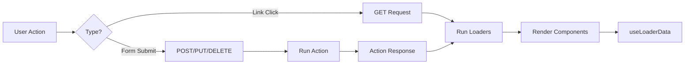

# Remix Data Fetching & Caching

> "Every piece of data has a source, a lifetime, and a destination." — Data Architecture Principle

Remix provides a powerful data fetching model that eliminates client-side state management for server data. Loaders fetch, actions mutate, and the framework handles revalidation automatically.

---

## Professional Definition

| Concept | Definition | Senior Consideration |
|---------|------------|---------------------|
| Loader Data Flow | Data flows from loaders through props to components | No global state stores needed for server data |
| Automatic Revalidation | Loaders refetch after every action | Always-fresh data without manual cache invalidation |
| Parallel Loading | Nested route loaders run simultaneously | Eliminates request waterfalls |
| Deferred Data | Stream non-critical data with `defer()` | Faster Time to First Byte (TTFB) |
| Resource Routes | Routes that return non-HTML responses | APIs, PDFs, images, RSS feeds |

---

## The Remix Data Flow Model



### Key Principles

1. **Loaders are the source of truth** - Components read from loaders, not local state
2. **Actions invalidate loaders** - After any mutation, all loaders rerun
3. **No cache invalidation** - The framework handles freshness automatically
4. **Request deduplication** - Same loader data isn't fetched twice per request

---

## Fetching Data with Loaders

```tsx
// app/routes/dashboard.tsx
import type { LoaderFunctionArgs } from "@remix-run/node";
import { json } from "@remix-run/node";
import { useLoaderData, Outlet } from "@remix-run/react";

export async function loader({ request }: LoaderFunctionArgs) {
  const user = await requireAuth(request);
  
  // Parallel data fetching
  const [notifications, stats] = await Promise.all([
    getNotifications(user.id),
    getDashboardStats(user.id),
  ]);
  
  return json({
    user,
    notifications,
    stats,
    serverTime: new Date().toISOString(),
  });
}

export default function Dashboard() {
  const data = useLoaderData<typeof loader>();
  
  return (
    <div>
      <Header user={data.user} notifications={data.notifications} />
      <StatsPanel stats={data.stats} />
      <Outlet /> {/* Child routes render here */}
    </div>
  );
}
```

---

## HTTP Response Helpers

### json() - Return JSON Data

```tsx
import { json } from "@remix-run/node";

export async function loader() {
  const data = await fetchData();
  
  // Simple usage
  return json(data);
  
  // With status code
  return json(data, { status: 200 });
  
  // With headers
  return json(data, {
    status: 200,
    headers: {
      "Cache-Control": "max-age=300, s-maxage=3600",
      "X-Custom-Header": "value",
    },
  });
}
```

### redirect() - Redirect Response

```tsx
import { redirect } from "@remix-run/node";

export async function action({ request }: ActionFunctionArgs) {
  await processForm(request);
  
  // Basic redirect
  return redirect("/success");
  
  // With status (301, 302, 303, 307, 308)
  return redirect("/new-location", { status: 301 });
  
  // With headers (e.g., set cookie)
  return redirect("/dashboard", {
    headers: {
      "Set-Cookie": await commitSession(session),
    },
  });
}
```

### Raw Response Object

```tsx
export async function loader() {
  const data = await fetchData();
  
  // Equivalent to json() helper
  return new Response(JSON.stringify(data), {
    status: 200,
    headers: {
      "Content-Type": "application/json",
    },
  });
}
```

---

## Deferred Data & Streaming

For non-critical data, use `defer()` to stream the response:

```tsx
import { defer } from "@remix-run/node";
import { useLoaderData, Await } from "@remix-run/react";
import { Suspense } from "react";

export async function loader({ params }: LoaderFunctionArgs) {
  // Critical data - await immediately
  const product = await getProduct(params.id);
  
  // Non-critical data - don't await, stream later
  const reviewsPromise = getReviews(params.id);
  const recommendationsPromise = getRecommendations(params.id);
  
  return defer({
    product, // Resolved data
    reviews: reviewsPromise, // Promise - will stream
    recommendations: recommendationsPromise,
  });
}

export default function ProductPage() {
  const { product, reviews, recommendations } = useLoaderData<typeof loader>();
  
  return (
    <div>
      {/* Critical content renders immediately */}
      <ProductDetails product={product} />
      
      {/* Reviews stream in when ready */}
      <Suspense fallback={<ReviewsSkeleton />}>
        <Await resolve={reviews} errorElement={<ReviewsError />}>
          {(resolvedReviews) => <ReviewsList reviews={resolvedReviews} />}
        </Await>
      </Suspense>
      
      {/* Recommendations stream separately */}
      <Suspense fallback={<RecommendationsSkeleton />}>
        <Await resolve={recommendations}>
          {(recs) => <RecommendationsGrid items={recs} />}
        </Await>
      </Suspense>
    </div>
  );
}
```

### When to Use Defer

| Use `defer()` when | Use regular `json()` when |
|-------------------|---------------------------|
| Data isn't needed for initial render | Data is critical for SEO |
| Fetching from slow APIs | Data determines page structure |
| Analytics/recommendations | Authentication checks |
| Comments/reviews | Main content |

---

## Automatic Revalidation

After any action, Remix automatically refetches all loaders:

```tsx
// User submits form → action runs → all loaders rerun → UI updates

export async function action({ request }: ActionFunctionArgs) {
  await createTodo(request);
  return json({ success: true });
  // After this returns, the page's loader automatically refetches
  // No manual cache invalidation needed!
}
```

### Controlling Revalidation

```tsx
import type { ShouldRevalidateFunction } from "@remix-run/react";

export const shouldRevalidate: ShouldRevalidateFunction = ({
  actionResult,
  currentParams,
  currentUrl,
  defaultShouldRevalidate,
  formAction,
  formData,
  formEncType,
  formMethod,
  nextParams,
  nextUrl,
}) => {
  // Skip revalidation if action succeeded
  if (actionResult?.success) {
    return false;
  }
  
  // Skip if only the hash changed
  if (currentUrl.pathname === nextUrl.pathname) {
    return false;
  }
  
  // Use default behavior
  return defaultShouldRevalidate;
};
```

---

## Using useFetcher for Data Loading

Load data without navigation:

```tsx
import { useFetcher } from "@remix-run/react";

function UserProfile({ userId }) {
  const fetcher = useFetcher<typeof userLoader>();
  
  useEffect(() => {
    if (fetcher.state === "idle" && !fetcher.data) {
      fetcher.load(`/api/users/${userId}`);
    }
  }, [userId, fetcher]);
  
  if (fetcher.state === "loading") {
    return <Skeleton />;
  }
  
  if (fetcher.data) {
    return <UserCard user={fetcher.data.user} />;
  }
  
  return null;
}

// app/routes/api.users.$userId.tsx (resource route)
export async function loader({ params }: LoaderFunctionArgs) {
  const user = await getUser(params.userId);
  return json({ user });
}
```

### Fetcher States

```tsx
const fetcher = useFetcher();

// fetcher.state values:
// "idle" - No pending request
// "loading" - GET request in progress (fetcher.load())
// "submitting" - POST/PUT/DELETE in progress (fetcher.submit())

// Check various conditions
const isLoading = fetcher.state === "loading";
const isSubmitting = fetcher.state === "submitting";
const isBusy = fetcher.state !== "idle";
const hasData = fetcher.data != null;
```

---

## Resource Routes (API Endpoints)

Routes without a `default` export become API endpoints:

```tsx
// app/routes/api.search.tsx
export async function loader({ request }: LoaderFunctionArgs) {
  const url = new URL(request.url);
  const query = url.searchParams.get("q") ?? "";
  const results = await searchProducts(query);
  
  return json({ results });
}

// No default export = resource route

// Usage from client:
// fetcher.load("/api/search?q=shoes")
// or: fetch("/api/search?q=shoes")
```

### Complex Resource Routes

```tsx
// app/routes/reports.$id[.csv].tsx
// URL: /reports/123.csv

export async function loader({ params }: LoaderFunctionArgs) {
  const report = await getReport(params.id);
  const csv = generateCSV(report);
  
  return new Response(csv, {
    headers: {
      "Content-Type": "text/csv",
      "Content-Disposition": `attachment; filename="report-${params.id}.csv"`,
    },
  });
}
```

```tsx
// app/routes/og-image.$title.tsx
// URL: /og-image/my-blog-post

export async function loader({ params }: LoaderFunctionArgs) {
  const title = decodeURIComponent(params.title);
  const imageBuffer = await generateOGImage(title);
  
  return new Response(imageBuffer, {
    headers: {
      "Content-Type": "image/png",
      "Cache-Control": "public, max-age=86400",
    },
  });
}
```

---

## Caching Strategies

### HTTP Cache Headers

```tsx
export async function loader({ request }: LoaderFunctionArgs) {
  const data = await fetchData();
  
  return json(data, {
    headers: {
      // Browser caches for 5 minutes
      // CDN caches for 1 hour
      // After 1 hour, serve stale while revalidating
      "Cache-Control": "max-age=300, s-maxage=3600, stale-while-revalidate=86400",
    },
  });
}
```

### Using the headers Export

```tsx
import type { HeadersFunction } from "@remix-run/node";

export const headers: HeadersFunction = ({ loaderHeaders }) => {
  return {
    "Cache-Control": loaderHeaders.get("Cache-Control") ?? "max-age=300",
  };
};
```

### Cache Control Directives

| Directive | Meaning |
|-----------|---------|
| `max-age=N` | Browser can cache for N seconds |
| `s-maxage=N` | CDN can cache for N seconds |
| `no-cache` | Must revalidate with server |
| `no-store` | Never cache |
| `private` | Only browser can cache (not CDN) |
| `public` | Anyone can cache |
| `stale-while-revalidate=N` | Serve stale content while fetching fresh |

---

## Error Handling in Data Fetching

### Throwing Responses

```tsx
export async function loader({ params }: LoaderFunctionArgs) {
  const post = await getPost(params.id);
  
  if (!post) {
    throw new Response("Post not found", { status: 404 });
  }
  
  if (post.isPrivate) {
    throw new Response("Unauthorized", { status: 401 });
  }
  
  return json({ post });
}

export function ErrorBoundary() {
  const error = useRouteError();
  
  if (isRouteErrorResponse(error)) {
    return (
      <div>
        <h1>{error.status} {error.statusText}</h1>
        <p>{error.data}</p>
      </div>
    );
  }
  
  return <div>Something went wrong</div>;
}
```

### Error Data in Thrown Responses

```tsx
throw json(
  { message: "Not authorized", reason: "Subscription expired" },
  { status: 403 }
);

// In ErrorBoundary:
if (isRouteErrorResponse(error)) {
  const data = error.data; // { message, reason }
}
```

---

## Accessing Parent Loader Data

```tsx
// app/routes/dashboard.tsx
export async function loader({ request }: LoaderFunctionArgs) {
  const user = await requireAuth(request);
  return json({ user });
}

// app/routes/dashboard.settings.tsx
import { useRouteLoaderData } from "@remix-run/react";
import type { loader as dashboardLoader } from "./dashboard";

export default function Settings() {
  // Access parent loader data
  const dashboardData = useRouteLoaderData<typeof dashboardLoader>("routes/dashboard");
  
  return (
    <div>
      <h1>Settings for {dashboardData?.user.name}</h1>
    </div>
  );
}
```

### Using useMatches for All Route Data

```tsx
import { useMatches } from "@remix-run/react";

function Breadcrumbs() {
  const matches = useMatches();
  
  return (
    <nav>
      {matches
        .filter((match) => match.handle?.breadcrumb)
        .map((match) => (
          <Link key={match.id} to={match.pathname}>
            {match.handle.breadcrumb(match.data)}
          </Link>
        ))}
    </nav>
  );
}

// In route files:
export const handle = {
  breadcrumb: (data) => data.user.name,
};
```

---

## Polling & Real-Time Data

### Simple Polling

```tsx
import { useRevalidator } from "@remix-run/react";

function Dashboard() {
  const revalidator = useRevalidator();
  
  useEffect(() => {
    const interval = setInterval(() => {
      if (revalidator.state === "idle") {
        revalidator.revalidate();
      }
    }, 30000); // Poll every 30 seconds
    
    return () => clearInterval(interval);
  }, [revalidator]);
  
  return <DashboardContent />;
}
```

### Event-Driven Updates

```tsx
function LiveFeed() {
  const revalidator = useRevalidator();
  
  useEffect(() => {
    const eventSource = new EventSource("/api/events");
    
    eventSource.onmessage = () => {
      revalidator.revalidate();
    };
    
    return () => eventSource.close();
  }, [revalidator]);
  
  return <FeedContent />;
}
```

---

## Senior Interview Focus Points

1. **Explain the Remix data flow:**
   - Loaders fetch data on the server
   - Data is serialized and sent to client
   - Components access data via `useLoaderData`
   - Actions mutate data and trigger revalidation
   - No client-side global state needed for server data

2. **How does revalidation work?**
   - After any action completes, all loaders for active routes refetch
   - This ensures UI is always in sync with server
   - `shouldRevalidate` can optimize unnecessary refetches

3. **When would you use defer()?**
   - Non-critical data that can load after initial render
   - Slow third-party API calls
   - Analytics, recommendations, comments
   - Never for SEO-critical content

4. **How do you handle API routes?**
   - Create resource routes (no default export)
   - Return raw Response objects
   - Can return JSON, CSV, images, PDFs, etc.

5. **What's the difference between fetcher.load and navigation?**
   - `fetcher.load()` - Loads data without changing URL
   - Navigation - Changes URL, updates browser history
   - Fetchers are for background data loading, popovers, etc.
